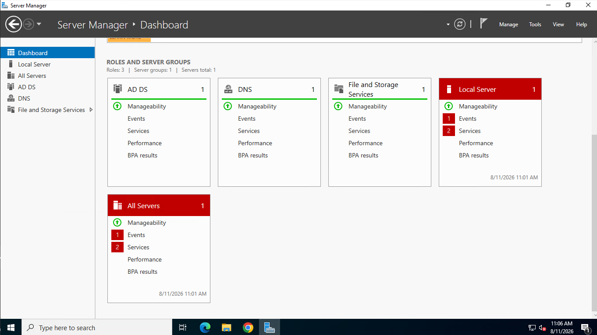
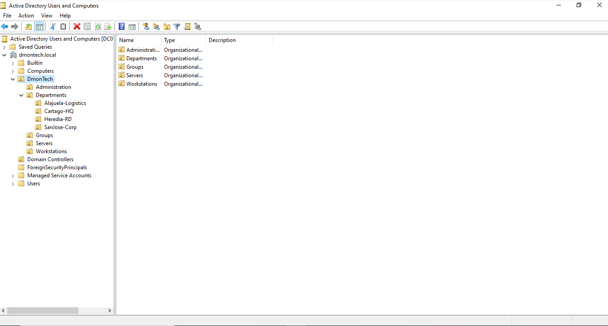

# 📂 Phase 1 — Active Directory On-Premises Design

## 📌 Objective

Establish a reliable and secure on-premises identity foundation for DmonTech's enterprise environment, providing centralized authentication, directory services, DNS, and administrative organization for users and domain-joined resources.

This Active Directory environment serves as the on-premises identity source for the project's hybrid integration with Microsoft Entra ID.

---

## 📐 Architecture & Configuration

| Component | Configuration |
|---|---|
| **Active Directory Domain** | `dmontech.local` |
| **Primary Domain Controller** | `DC01` |
| **Operating System** | Windows Server 2022 |
| **IPv4 Address** | `192.168.10.10/24` |
| **Directory Service** | Active Directory Domain Services (AD DS) |
| **DNS Service** | Active Directory-integrated DNS |
| **Local DNS Configuration** | `127.0.0.1` |

`DC01` was deployed as the initial Domain Controller and DNS server for the `dmontech.local` forest.

---

## 🖥️ Domain Controller Deployment

Active Directory Domain Services and DNS were installed on `DC01`, establishing the first Domain Controller for the DmonTech environment.

The server uses a static IPv4 address to provide predictable availability for domain authentication and DNS services.

```text
DC01
├── Windows Server 2022
├── AD DS
├── DNS
├── 192.168.10.10/24
└── dmontech.local
```

### 📸 Deployment Evidence

The Server Manager dashboard confirms that the **Active Directory Domain Services (AD DS)** and **DNS** roles are installed and managed on the Windows Server environment.



---

## 🗂️ Organizational Unit Design

The `dmontech.local` directory was structured using Organizational Units (OUs) to provide logical separation between administrative accounts, departments, groups, servers, and workstations.

The primary organizational structure is:

```text
dmontech.local
│
└── DmonTech
    ├── Administration
    ├── Departments
    │   ├── Alajuela-Logistics
    │   ├── Cartago-HQ
    │   ├── Heredia-RD
    │   └── SanJose-Corp
    ├── Groups
    ├── Servers
    └── Workstations
```

This structure provides a scalable foundation for user and computer organization, Group Policy targeting, and administrative management across the simulated DmonTech locations.

### 📸 Active Directory Structure

The following view from **Active Directory Users and Computers** validates the `dmontech.local` domain and the implemented DmonTech OU hierarchy.



---

## 🧠 Architectural Decisions

### Active Directory as the Identity Source

The simulated DmonTech environment includes traditional Windows infrastructure and domain-joined resources that require centralized directory services.

Active Directory therefore provides the identity foundation for:

- User and computer authentication
- Organizational Unit management
- Group Policy processing
- Active Directory-integrated DNS
- Domain resource administration
- Integration with the project's hybrid identity environment

### Internal Active Directory Namespace

The on-premises forest uses:

```text
dmontech.local
```

as its internal Active Directory namespace.

A separate routable UPN suffix, `dmontech.com`, is used later in the Hybrid Identity implementation to align synchronized user identities with Microsoft Entra ID while retaining the existing internal AD DS namespace.

---

## 🔐 Identity Foundation

The resulting architecture establishes `DC01` as the initial identity and DNS infrastructure for the DmonTech domain:

```text
                 dmontech.local
                       │
                       ▼
                      DC01
                       │
          ┌────────────┼────────────┐
          │            │            │
        AD DS          DNS      OU Structure
          │                         │
          │                  Users / Computers
          │
          ▼
   Centralized Identity
```

This environment provides the foundation for the additional Domain Controller, Active Directory replication, and Hybrid Identity components documented separately within this section of the repository.

---

## ✅ Implementation Outcome

The deployment established:

- `dmontech.local` Active Directory forest and domain
- Windows Server 2022 Domain Controller
- Active Directory Domain Services
- Active Directory-integrated DNS
- Static Domain Controller addressing
- Structured Organizational Units
- Logical separation of departments, servers, workstations, groups, and administrative objects
- Centralized identity foundation for the DmonTech hybrid environment