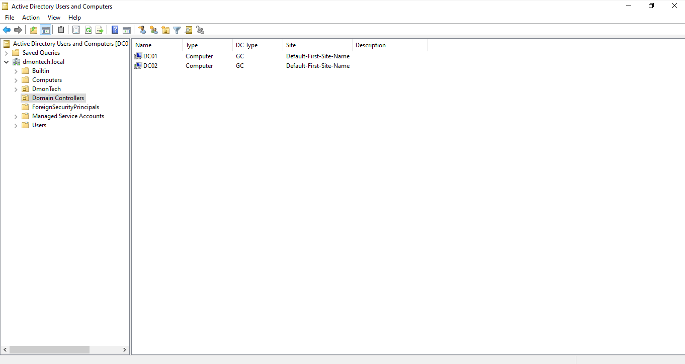
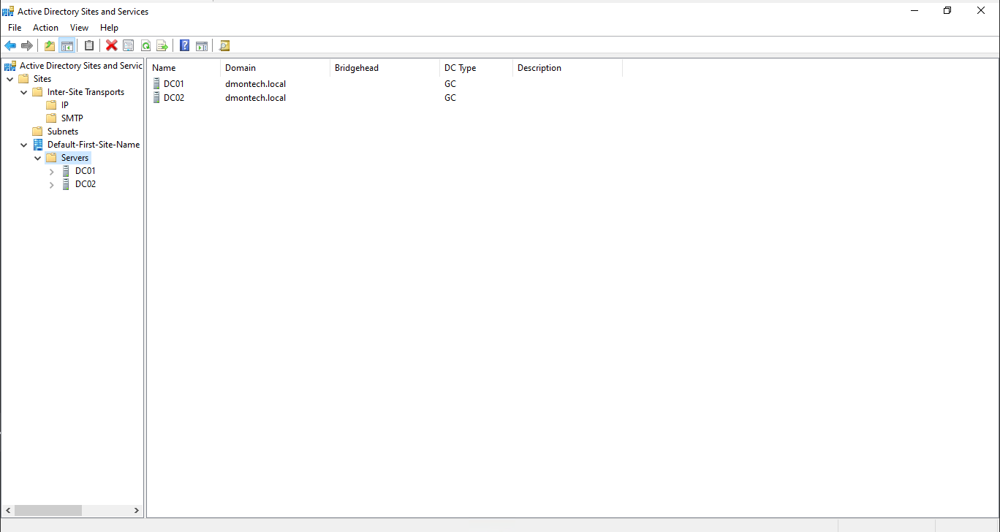
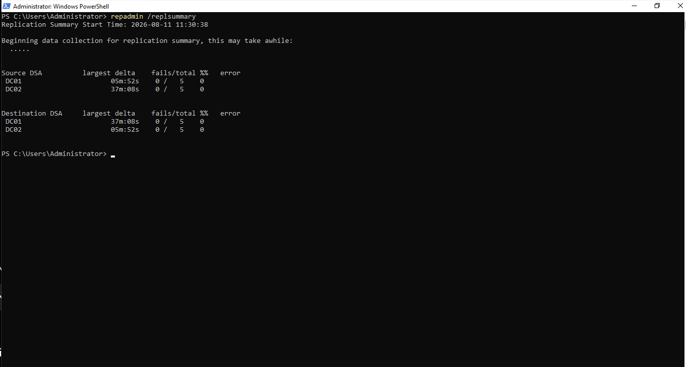

# 🔄 Phase 1.1 — Active Directory High Availability & Replication

## 📌 Objective

Increase the resilience of DmonTech's on-premises identity infrastructure by deploying a second Domain Controller and validating Active Directory replication between both directory servers.

The implementation provides redundant Active Directory Domain Services and DNS capabilities within the `dmontech.local` domain, reducing dependency on a single Domain Controller.

---

## 🏗️ Domain Controller Topology

The environment contains two Windows Server 2022 Domain Controllers:

| Server | Role | IPv4 Address | Primary DNS | Secondary DNS |
|---|---|---|---|---|
| **DC01** | Domain Controller / DNS / Global Catalog | `192.168.10.10/24` | `127.0.0.1` | `192.168.10.11` |
| **DC02** | Domain Controller / DNS / Global Catalog | `192.168.10.11/24` | `192.168.10.10` | `127.0.0.1` |

`DC02` was joined to `dmontech.local` and subsequently promoted as an additional Domain Controller with DNS and Global Catalog capabilities.

The DNS configuration allows each Domain Controller to reference the other server while retaining local DNS resolution.

```text
              dmontech.local
                     │
          ┌──────────┴──────────┐
          │                     │
          ▼                     ▼
        DC01                  DC02
  192.168.10.10         192.168.10.11
          │                     │
       AD DS                  AD DS
        DNS                    DNS
        GC                     GC
          │                     │
          └──── Replication ────┘
```

---

## 🖥️ Domain Controller Validation

Active Directory Users and Computers confirms that both `DC01` and `DC02` are registered in the **Domain Controllers** container for `dmontech.local`.

Both servers are also identified as **Global Catalog (GC)** servers.

### 📸 Domain Controllers



---

## 🌐 Active Directory Site Configuration

Both Domain Controllers are currently associated with:

```text
Default-First-Site-Name
```

within Active Directory Sites and Services.

The configuration represents the current single-site topology of the lab while maintaining two Domain Controllers for directory and DNS redundancy.

### 📸 Sites and Services Topology

Active Directory Sites and Services confirms that both servers are registered under the site's `Servers` container.



---

## 🔄 Active Directory Replication

Active Directory replication was configured between `DC01` and `DC02`, allowing directory changes to propagate between both Domain Controllers.

This provides redundancy for the directory service and ensures that both servers maintain synchronized copies of Active Directory data.

During the implementation, DNS-related replication issues were encountered and resolved by correcting DNS configuration between the Domain Controllers and re-registering required DNS records.

The following command was used as part of DNS registration troubleshooting:

```powershell
nltest /dsregdns
```

Replication health was subsequently validated using:

```powershell
repadmin /replsummary
```

---

## 🧪 Replication Validation

The replication summary confirms successful communication between both Domain Controllers.

At the time of validation:

| Replication Role | DC01 | DC02 |
|---|---:|---:|
| **Source DSA Failures** | `0 / 5` | `0 / 5` |
| **Source Error Rate** | `0%` | `0%` |
| **Destination DSA Failures** | `0 / 5` | `0 / 5` |
| **Destination Error Rate** | `0%` | `0%` |

No replication failures were reported for either Domain Controller during the validation.

### 📸 Replication Health



---

## 🛡️ Availability Design

The resulting directory architecture removes the original dependency on a single Active Directory server.

```text
                  Domain Clients
                       │
                       ▼
                 dmontech.local
                       │
            ┌──────────┴──────────┐
            │                     │
            ▼                     ▼
          DC01 ◄──────────────► DC02
            │     AD Replication   │
            │                      │
         AD DS                  AD DS
          DNS                    DNS
           GC                     GC
```

With both servers providing AD DS, DNS, and Global Catalog functionality, the environment has redundant directory service infrastructure for the simulated DmonTech domain.

---

## 🧠 Technical Decisions

### Secondary Domain Controller

Deploying `DC02` prevents the directory architecture from relying entirely on `DC01`.

The additional Domain Controller provides:

- A replicated copy of Active Directory
- Additional authentication capability
- DNS redundancy
- Global Catalog redundancy
- Improved resilience of the identity infrastructure

### Cross-Domain-Controller DNS Configuration

The Domain Controllers were configured to reference each other through DNS:

```text
DC01
Primary DNS:   127.0.0.1
Secondary DNS: 192.168.10.11

DC02
Primary DNS:   192.168.10.10
Secondary DNS: 127.0.0.1
```

This design provides access to an alternate Active Directory-integrated DNS server if the local DNS service becomes unavailable.

### Replication Verification

Deployment of a second Domain Controller alone does not demonstrate directory resilience.

Replication was therefore explicitly validated using `repadmin`, confirming that both Domain Controllers were successfully participating in Active Directory replication without reported failures at the time of testing.

---

## ✅ Implementation Outcome

The completed configuration established:

- Two Windows Server 2022 Domain Controllers
- Redundant Active Directory Domain Services
- Active Directory-integrated DNS on both Domain Controllers
- Global Catalog functionality on `DC01` and `DC02`
- Cross-server DNS configuration
- Active Directory replication between both Domain Controllers
- Active Directory Sites and Services registration
- Successful replication validation with `0%` reported errors