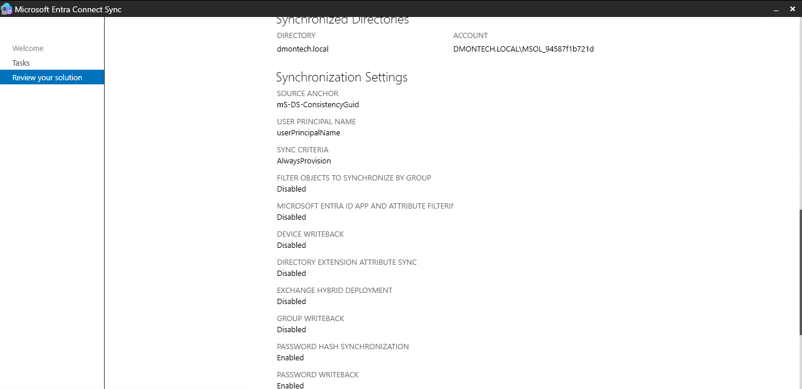
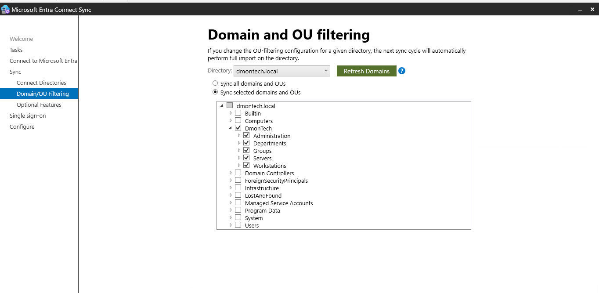
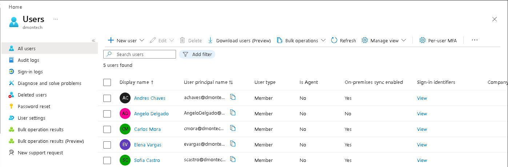

# ☁️ Phase 2 & 3 — Hybrid Identity & Password Writeback

## 📌 Objective

Extend DmonTech's on-premises Active Directory environment to Microsoft Entra ID by implementing hybrid identity synchronization with Microsoft Entra Connect Sync.

The implementation provides a unified identity model in which selected identities from `dmontech.local` are synchronized to Microsoft Entra ID while maintaining the on-premises Active Directory environment as the source for synchronized objects.

---

## 🏗️ Hybrid Identity Architecture

Microsoft Entra Connect Sync was deployed to integrate the on-premises Active Directory environment with the DmonTech Microsoft Entra tenant.

| Component | Configuration |
|---|---|
| **On-Premises Directory** | `dmontech.local` |
| **Synchronization Engine** | Microsoft Entra Connect Sync |
| **Source Anchor** | `ms-DS-ConsistencyGuid` |
| **UPN Attribute** | `userPrincipalName` |
| **Authentication Method** | Password Hash Synchronization (PHS) |
| **Password Hash Synchronization** | Enabled |
| **Password Writeback** | Enabled |
| **OU Filtering** | Enabled |
| **Cloud UPN Suffix** | `@dmontech.com` |

The resulting identity flow is:

```text
             On-Premises
          Active Directory
          dmontech.local
                 │
                 │
                 │ Microsoft Entra Connect Sync
                 │
                 ▼
        Microsoft Entra ID
                 │
                 │
        @dmontech.com identities
```

---

## 🔄 Synchronization Configuration

Microsoft Entra Connect Sync was configured to synchronize the `dmontech.local` directory with Microsoft Entra ID.

**Password Hash Synchronization (PHS)** is enabled as the authentication method, allowing synchronized users to authenticate to Microsoft cloud services using identities derived from the on-premises directory.

**Password Writeback** is also enabled in the synchronization configuration to support cloud-initiated password operations being written back to the on-premises Active Directory environment when used with the appropriate Microsoft Entra password reset configuration and licensing.

The synchronization configuration uses:

```text
Source Anchor:       ms-DS-ConsistencyGuid
UPN Attribute:       userPrincipalName
Password Hash Sync:  Enabled
Password Writeback:  Enabled
```

### 📸 Entra Connect Configuration

The current Microsoft Entra Connect configuration confirms the synchronized directory, source anchor, UPN attribute, Password Hash Synchronization, and Password Writeback settings.



---

## 🎯 Organizational Unit Filtering

Synchronization was intentionally restricted instead of synchronizing the entire `dmontech.local` directory.

Microsoft Entra Connect is configured using:

```text
Sync selected domains and OUs
```

with the `DmonTech` organizational structure selected for synchronization.

The synchronized scope includes:

```text
dmontech.local
│
└── DmonTech
    ├── Administration
    ├── Departments
    ├── Groups
    ├── Servers
    └── Workstations
```

Built-in and infrastructure containers outside the DmonTech organizational structure are excluded from the synchronization scope.

This prevents unnecessary Active Directory objects from automatically entering the cloud identity environment.

### 📸 Domain and OU Filtering

The Microsoft Entra Connect configuration confirms that synchronization is scoped to the DmonTech OU structure rather than the entire Active Directory domain.



---

## 👤 User Principal Name Alignment

The on-premises Active Directory domain uses the internal namespace:

```text
dmontech.local
```

while synchronized cloud identities use the routable UPN suffix:

```text
@dmontech.com
```

This allows users to maintain an internal Active Directory domain while using cloud-compatible identities in Microsoft Entra ID.

Example:

```text
On-Premises AD
Carlos Mora
UPN: cmora@dmontech.com
        │
        │ Entra Connect Sync
        ▼
Microsoft Entra ID
cmora@dmontech.com
```

---

## ☁️ Cloud Synchronization Validation

Synchronization was validated directly from the Microsoft Entra admin center.

Multiple DmonTech identities are registered with:

```text
On-premises sync enabled: Yes
```

The validated synchronized identities include:

- Andres Chaves
- Carlos Mora
- Elena Vargas
- Sofia Castro

A cloud-only administrative identity is also present with:

```text
On-premises sync enabled: No
```

providing a clear distinction between synchronized identities and cloud-native accounts.

### 📸 Synchronized Identities

The Microsoft Entra user inventory confirms that the DmonTech users were successfully synchronized from the on-premises directory.



---

## 🔐 Password Synchronization & Writeback

The hybrid identity configuration enables two complementary password capabilities.

### Password Hash Synchronization

Password Hash Synchronization allows the Microsoft Entra identity environment to authenticate synchronized users without requiring authentication requests to be continuously forwarded to the on-premises Domain Controllers.

```text
On-Premises AD
      │
      │ Password Hash Synchronization
      ▼
Microsoft Entra ID
```

### Password Writeback

Password Writeback is enabled in Microsoft Entra Connect Sync, providing the synchronization component required for supported cloud password changes and resets to be written back to the corresponding on-premises Active Directory account.

```text
Microsoft Entra ID
      │
      │ Password Writeback
      ▼
Microsoft Entra Connect
      │
      ▼
On-Premises AD
```

Together, these capabilities establish the password synchronization foundation for the hybrid identity environment.

---

## 🧠 Architectural Decisions

### Scoped Synchronization

Only the DmonTech organizational structure is included in the synchronization scope.

This follows the principle of minimizing unnecessary cloud identities and prevents default Active Directory containers and infrastructure objects from being synchronized without a business requirement.

### Routable Cloud Identity

Using `@dmontech.com` for synchronized user identities provides a cloud-compatible sign-in namespace while preserving the existing `dmontech.local` Active Directory domain.

### Password Hash Synchronization

PHS provides a comparatively simple hybrid authentication architecture without introducing additional federation infrastructure into the lab environment.

### Separation of Synchronized and Cloud-Only Identities

The environment maintains both synchronized identities and a cloud-only administrative identity.

This demonstrates the distinction between identities whose lifecycle originates in on-premises Active Directory and accounts managed directly within Microsoft Entra ID.

---

## ✅ Implementation Outcome

The Hybrid Identity implementation established:

- Integration between `dmontech.local` and Microsoft Entra ID
- Microsoft Entra Connect Sync
- Password Hash Synchronization
- Password Writeback enabled in Entra Connect
- `ms-DS-ConsistencyGuid` as the source anchor
- `userPrincipalName` as the synchronized UPN attribute
- `@dmontech.com` cloud identity alignment
- Scoped synchronization using Domain and OU filtering
- Exclusion of unnecessary Active Directory containers from synchronization
- Successful provisioning of selected on-premises identities into Microsoft Entra ID
- Separation between synchronized and cloud-only identities