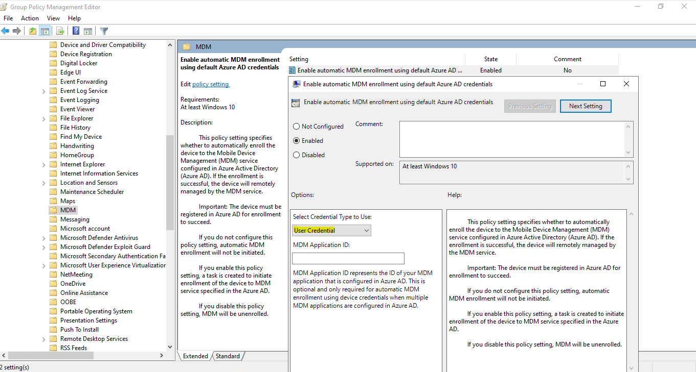
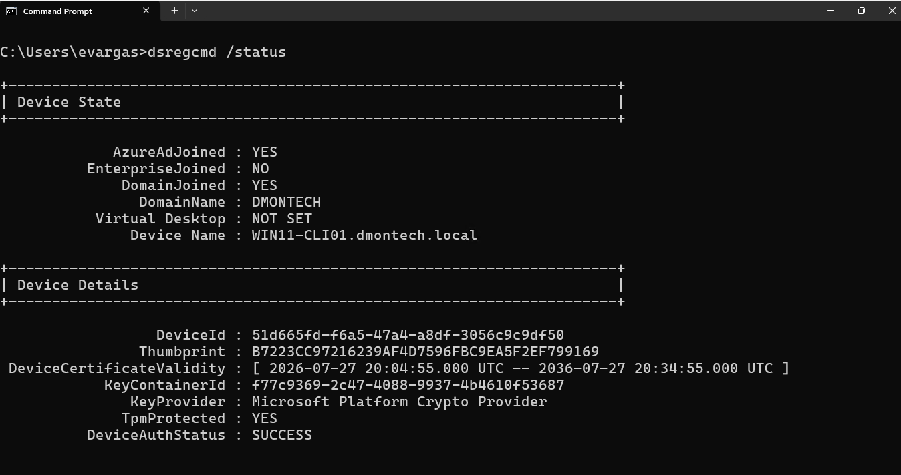
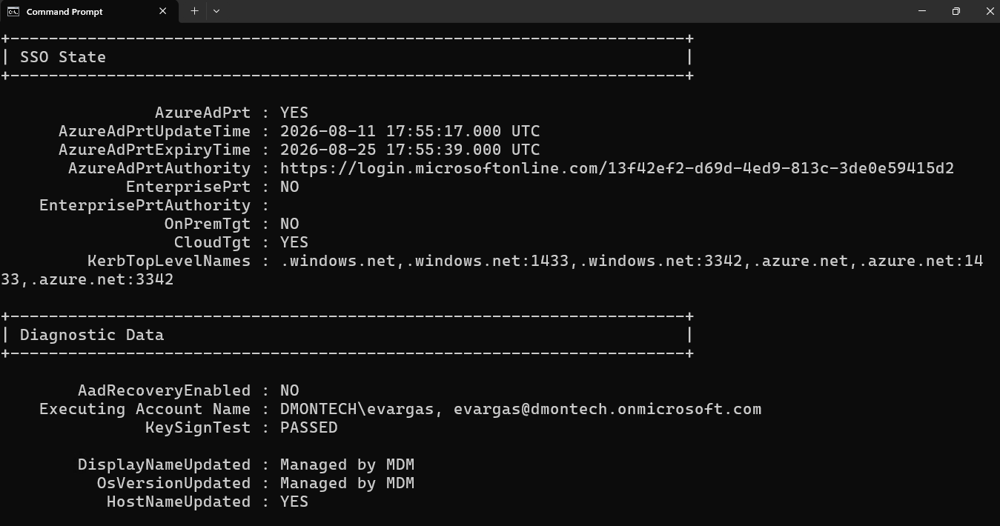
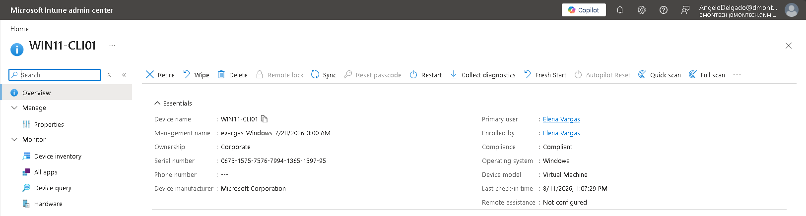

# 📱 Phase 4 — Microsoft Intune Automatic Enrollment & Hybrid Device Identity

## 📌 Objective

Extend DmonTech's hybrid identity architecture to endpoint management by automatically enrolling domain-joined Windows devices into Microsoft Intune.

The implementation allows Windows endpoints to maintain their existing Active Directory domain relationship while establishing a Microsoft Entra device identity and enrolling into Microsoft Intune for centralized cloud-based management.

The deployment was validated using `WIN11-CLI01`, a Windows 11 endpoint joined to the `dmontech.local` Active Directory domain.

---

## 🏗️ Endpoint Management Architecture

DmonTech uses a hybrid device identity model combining:

- Active Directory Domain Services
- Microsoft Entra ID
- Microsoft Entra Connect Sync
- Group Policy
- Microsoft Intune

The resulting enrollment architecture is:

```text
                    DmonTech Hybrid Identity
                              │
              ┌───────────────┴───────────────┐
              │                               │
              ▼                               ▼
      Active Directory                 Microsoft Entra ID
       dmontech.local                         │
              │                               │
              │ Domain Join                   │ Device Identity
              │                               │
              └──────────► WIN11-CLI01 ◄──────┘
                              │
                              │
                       Hybrid Entra Join
                              │
                              ▼
                    Primary Refresh Token
                         AzureAdPrt = YES
                              │
                              │ GPO Auto-Enrollment
                              ▼
                      Microsoft Intune
                              │
                              ▼
                   Cloud Endpoint Management
```

---

## 🖥️ Target Endpoint

| Component | Configuration |
|---|---|
| **Device** | `WIN11-CLI01` |
| **On-Premises Domain** | `dmontech.local` |
| **Domain NetBIOS Name** | `DMONTECH` |
| **Device Identity** | Hybrid Microsoft Entra joined |
| **Enrollment Method** | Group Policy automatic MDM enrollment |
| **Credential Type** | User Credential |
| **MDM Platform** | Microsoft Intune |
| **Ownership** | Corporate |

The endpoint maintains its Active Directory domain membership while also establishing a Microsoft Entra device identity.

---

## ⚙️ Automatic MDM Enrollment

Automatic Microsoft Intune enrollment was configured through Active Directory Group Policy.

### Group Policy Configuration

The following policy was enabled:

```text
Computer Configuration
└── Policies
    └── Administrative Templates
        └── Windows Components
            └── MDM
                └── Enable automatic MDM enrollment
                    using default Azure AD credentials
```

> The policy name uses the legacy "Azure AD" terminology present in the Windows Administrative Template. Azure Active Directory is now Microsoft Entra ID.

Configuration:

```text
Policy State:     Enabled
Credential Type:  User Credential
```

Once applied to the domain-joined endpoint, the policy initiates automatic MDM enrollment using the user's Microsoft Entra credentials.

### 📸 Automatic Enrollment GPO

The Group Policy configuration confirms that automatic MDM enrollment is enabled using **User Credential** authentication.



---

## 🔗 Hybrid Microsoft Entra Join Validation

Device registration was validated locally using:

```powershell
dsregcmd /status
```

The device state returned:

```text
AzureAdJoined    : YES
EnterpriseJoined : NO
DomainJoined     : YES
DomainName       : DMONTECH
Device Name      : WIN11-CLI01.dmontech.local
```

The combination of:

```text
AzureAdJoined : YES
DomainJoined  : YES
```

confirms that `WIN11-CLI01` has a **Hybrid Microsoft Entra joined** identity.

Additional device authentication information reported:

```text
TpmProtected     : YES
DeviceAuthStatus : SUCCESS
```

This confirms that the device identity is successfully authenticated and its device key is protected by the Trusted Platform Module (TPM).

### 📸 Hybrid Device State



---

## 🔐 Primary Refresh Token Validation

The authenticated user session was also validated through `dsregcmd /status`.

The SSO state reported:

```text
AzureAdPrt : YES
CloudTgt   : YES
```

A valid **Microsoft Entra Primary Refresh Token (PRT)** confirms that the signed-in domain user successfully obtained a cloud authentication token for Microsoft Entra resources.

The diagnostic output also reported:

```text
KeySignTest        : PASSED
DisplayNameUpdated : Managed by MDM
OsVersionUpdated   : Managed by MDM
HostNameUpdated    : YES
```

This provides additional local evidence that the endpoint has established its Microsoft Entra identity and is participating in MDM management.

### 📸 PRT & MDM State



---

## 🌐 Microsoft Intune Enrollment

Following Hybrid Microsoft Entra registration and application of the automatic enrollment policy, `WIN11-CLI01` successfully enrolled into Microsoft Intune.

The device appears in the Microsoft Intune admin center with the following validated properties:

| Property | Result |
|---|---|
| **Device Name** | `WIN11-CLI01` |
| **Ownership** | Corporate |
| **Primary User** | Elena Vargas |
| **Enrolled By** | Elena Vargas |
| **Compliance** | Compliant |
| **Operating System** | Windows |
| **Device Model** | Virtual Machine |

The endpoint also reports an active **Last check-in** timestamp, confirming communication between the Windows client and Microsoft Intune.

### 📸 Intune Device Validation



---

## 🧪 Enrollment Troubleshooting

The initial automatic enrollment attempt did not complete successfully.

Troubleshooting was performed using the Windows:

```text
DeviceManagement-Enterprise-Diagnostics-Provider
```

event logs.

Enrollment-related errors included Event IDs `52`, `71`, and `76`.

Observed messages included:

```text
Device based token is not supported for enrollment type
OnPremiseGroupPolicyCoManaged
```

and:

```text
Auto MDM Enroll: Device Credential (0x0), Failed
(Mobile Device Management (MDM) is not configured.)
```

---

## 🔎 Root Cause Analysis

Investigation identified two primary issues affecting automatic enrollment.

### Credential Type Mismatch

The endpoint attempted enrollment using a device-based credential while the enrollment scenario required user credential authentication.

The Group Policy configuration was therefore explicitly configured with:

```text
Credential Type: User Credential
```

### Stale Enrollment State

Previous enrollment attempts had left enrollment-related state on the endpoint, including registry entries and scheduled tasks.

Relevant locations included:

```text
HKLM\SOFTWARE\Microsoft\Enrollments
```

and:

```text
\Microsoft\Windows\EnterpriseMgmt\
```

These stale artifacts interfered with subsequent enrollment attempts.

---

## 🛠️ Remediation

The enrollment issue was resolved through the following actions:

1. Configured the automatic MDM enrollment GPO to use **User Credential**.
2. Removed stale enrollment registry entries associated with previous enrollment attempts.
3. Removed orphaned Enterprise Management scheduled tasks.
4. Verified the MDM policy configuration under:

```text
HKLM\SOFTWARE\Policies\Microsoft\Windows\CurrentVersion\MDM
```

5. Ensured automatic enrollment was configured with:

```text
AutoEnrollMDM        = 1
UseAADCredentialType = 1
```

6. Refreshed the user authentication session.
7. Verified that the user obtained a valid Microsoft Entra PRT.
8. Revalidated the device registration and MDM enrollment state.

After remediation, the endpoint successfully completed enrollment and appeared in Microsoft Intune.

---

## 🧠 Technical Decisions

### Hybrid Device Identity

DmonTech retains Active Directory domain membership because the simulated environment continues to depend on traditional on-premises identity and infrastructure services.

Hybrid Microsoft Entra Join extends those devices into Microsoft Entra ID without immediately removing their existing domain relationship.

This provides a migration path from traditional domain-based endpoint administration toward cloud-based management.

### Group Policy Automatic Enrollment

Group Policy was selected as the enrollment mechanism because the target devices already belong to the Active Directory domain.

This allows Intune enrollment to be initiated centrally without requiring users to manually enroll their corporate endpoints.

### User Credential Enrollment

User Credential was used for automatic MDM enrollment after troubleshooting demonstrated that the previous device credential attempt was unsuccessful in the implemented enrollment scenario.

### Validation Beyond the Admin Portal

Successful enrollment was not determined solely by the presence of the device in Microsoft Intune.

The endpoint was validated locally using `dsregcmd /status` to verify:

```text
AzureAdJoined    : YES
DomainJoined     : YES
AzureAdPrt       : YES
DeviceAuthStatus : SUCCESS
```

This provides endpoint-side evidence of both the hybrid device identity and cloud authentication state.

---

## 🔄 End-to-End Enrollment Validation

The completed implementation validates the entire endpoint enrollment path:

```text
Active Directory
      │
      │ Domain Join
      ▼
WIN11-CLI01
      │
      ├── DomainJoined = YES
      │
      │ Microsoft Entra Registration
      ▼
Hybrid Microsoft Entra Join
      │
      ├── AzureAdJoined = YES
      ├── DeviceAuthStatus = SUCCESS
      │
      │ User Authentication
      ▼
Microsoft Entra ID
      │
      ├── AzureAdPrt = YES
      │
      │ GPO Automatic MDM Enrollment
      ▼
Microsoft Intune
      │
      ├── Ownership = Corporate
      ├── Primary User = Elena Vargas
      ├── Compliance = Compliant
      └── Active Device Check-In
```

---

## ✅ Implementation Outcome

The completed endpoint enrollment implementation established:

- Windows 11 Active Directory domain membership
- Hybrid Microsoft Entra device identity
- Successful Microsoft Entra device authentication
- TPM-protected device identity
- Primary Refresh Token acquisition
- Group Policy-based automatic MDM enrollment
- User Credential authentication for enrollment
- Microsoft Intune device enrollment
- Corporate device ownership
- Active communication with Microsoft Intune
- Successful endpoint-side and cloud-side validation
- Troubleshooting and remediation of failed MDM enrollment