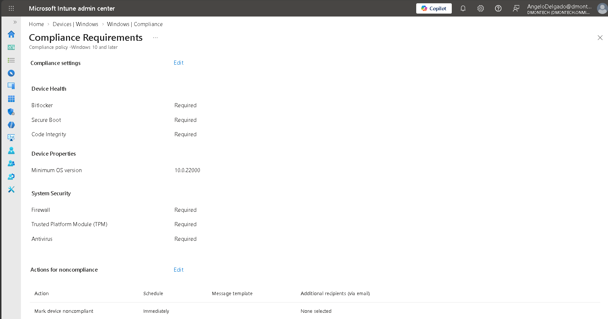
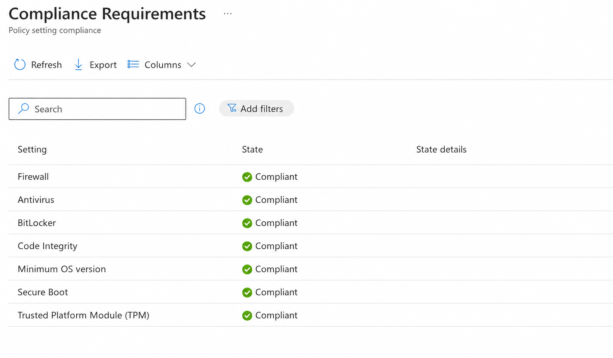
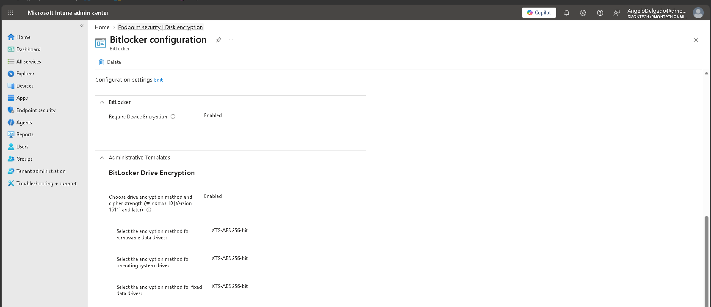
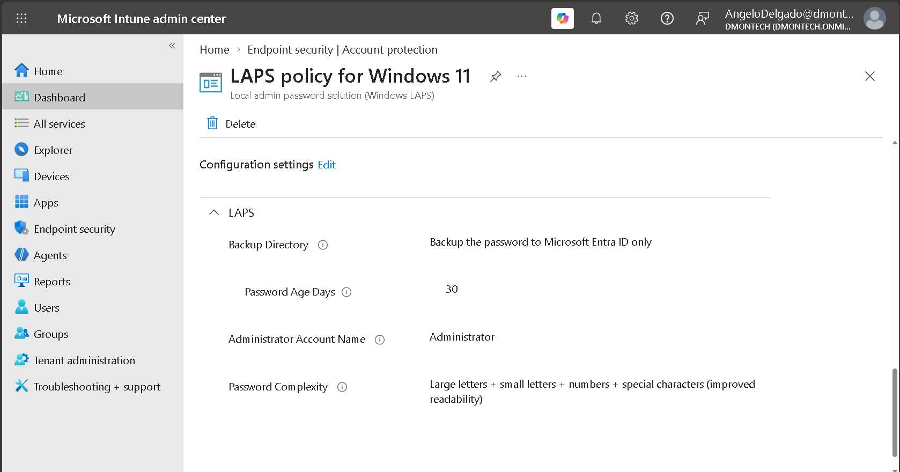

# 🛡️ Phase 4.1 — Device Compliance, BitLocker & Windows LAPS

## 📌 Objective

Establish a security and compliance baseline for DmonTech-managed Windows endpoints using Microsoft Intune.

Following successful enrollment of `WIN11-CLI01`, Microsoft Intune was configured to evaluate device health, enforce disk encryption requirements, and centrally manage the local administrator credential through Windows LAPS.

The implementation focuses on three endpoint security controls:

- Device Compliance
- BitLocker Drive Encryption
- Windows LAPS

---

## 🏗️ Endpoint Security Architecture

The endpoint security model extends DmonTech's Intune-managed device architecture with policy-based security enforcement.

```text
                    Microsoft Intune
                          │
          ┌───────────────┼───────────────┐
          │               │               │
          ▼               ▼               ▼
     Compliance        BitLocker      Windows LAPS
       Policy          Encryption         Policy
          │               │               │
          └───────────────┼───────────────┘
                          │
                          ▼
                     WIN11-CLI01
                          │
                 Security Evaluation
                          │
                          ▼
                       Compliant
```

---

## ✅ Device Compliance Policy

A Windows compliance policy named `Compliance Requirements` was configured to establish the minimum security posture required for managed DmonTech endpoints.

### Compliance Requirements

| Security Control | Requirement |
|---|---|
| **BitLocker** | Required |
| **Secure Boot** | Required |
| **Code Integrity** | Required |
| **Minimum OS Version** | `10.0.22000` |
| **Firewall** | Required |
| **Trusted Platform Module (TPM)** | Required |
| **Antivirus** | Required |

Devices that fail the required security controls are configured to be marked noncompliant immediately.

```text
Action:    Mark device noncompliant
Schedule:  Immediately
```

### 📸 Compliance Policy Configuration

The configured Windows compliance policy requires encryption, platform integrity, endpoint protection, and a minimum supported operating system version.



---

## 🧪 Compliance Validation

The compliance policy was evaluated against the managed Windows endpoint.

The resulting policy evaluation reported:

```text
Firewall                       Compliant
Antivirus                      Compliant
BitLocker                      Compliant
Code Integrity                 Compliant
Minimum OS version             Compliant
Secure Boot                    Compliant
Trusted Platform Module (TPM)  Compliant
```

This confirms that `WIN11-CLI01` satisfied all configured compliance requirements at the time of validation.

### 📸 Compliance Evaluation



---

## 🔐 BitLocker Drive Encryption

Microsoft Intune Endpoint Security was used to configure BitLocker encryption requirements for managed Windows endpoints.

The BitLocker policy requires device encryption and explicitly defines the encryption method used across the supported drive categories.

### Encryption Configuration

| Setting | Configuration |
|---|---|
| **Require Device Encryption** | Enabled |
| **Encryption Method Policy** | Enabled |
| **Operating System Drives** | XTS-AES 256-bit |
| **Fixed Data Drives** | XTS-AES 256-bit |
| **Removable Data Drives** | XTS-AES 256-bit |

Using centrally defined encryption settings ensures that managed endpoints follow a consistent disk encryption standard rather than relying on individual user configuration.

### 📸 BitLocker Policy



---

## 🔎 BitLocker Validation

BitLocker was also included as a mandatory control in the DmonTech compliance policy.

During policy evaluation, `WIN11-CLI01` reported:

```text
BitLocker : Compliant
```

This provides device compliance evidence that the endpoint satisfied the configured BitLocker requirement.

> **Note:** BitLocker recovery key escrow to Microsoft Entra ID was not validated as part of this implementation. Therefore, recovery key backup is not claimed as a verified project outcome.

---

## 🔑 Windows LAPS

Windows Local Administrator Password Solution (LAPS) was configured through Microsoft Intune Endpoint Security to centrally manage the password of the endpoint's local administrator account.

This reduces the security risk associated with static or reused local administrator credentials across enterprise endpoints.

### LAPS Configuration

| Setting | Configuration |
|---|---|
| **Backup Directory** | Microsoft Entra ID only |
| **Password Age** | 30 days |
| **Administrator Account Name** | `Administrator` |
| **Password Complexity** | Uppercase + lowercase + numbers + special characters |

The policy targets the local:

```text
Administrator
```

account and defines a 30-day password rotation interval.

The configured backup destination is:

```text
Microsoft Entra ID only
```

allowing the LAPS-managed credential to use Microsoft Entra ID as its configured password backup directory.

### 📸 Windows LAPS Policy



---

## 🧠 Security Design Decisions

### Compliance as a Security Gate

Enrollment into Microsoft Intune does not by itself establish that an endpoint satisfies DmonTech's security requirements.

The compliance policy evaluates device health characteristics including:

```text
Encryption
Secure Boot
TPM
Code Integrity
Firewall
Antivirus
Operating System Version
```

This creates a measurable device security posture that can be consumed by other identity and access controls.

### Immediate Noncompliance

The policy is configured to mark devices noncompliant immediately when they fail the required controls.

This minimizes the period during which a device can remain outside the defined security baseline while still reporting a healthy compliance state.

### XTS-AES 256-bit Encryption

BitLocker was configured with XTS-AES 256-bit encryption across operating system, fixed data, and removable data drives to establish a consistent encryption standard for managed Windows endpoints.

### Centralized Local Administrator Management

Windows LAPS eliminates the need to maintain a manually configured static local administrator password.

The implemented policy defines automatic password rotation and configures Microsoft Entra ID as the backup directory for the managed local administrator credential.

---

## 🔄 Security Enforcement Flow

The resulting endpoint security workflow is:

```text
                    WIN11-CLI01
                          │
                          ▼
                   Microsoft Intune
                          │
        ┌─────────────────┼─────────────────┐
        │                 │                 │
        ▼                 ▼                 ▼
   Compliance         BitLocker        Windows LAPS
    Evaluation        Encryption      Password Policy
        │                 │                 │
        ▼                 ▼                 ▼
  Security Health     XTS-AES 256     Local Administrator
    Validation         Encryption      Credential Control
        │                                   │
        └─────────────────┬─────────────────┘
                          │
                          ▼
                 Managed Security Posture
```

---

## 🔐 Zero Trust Alignment

These endpoint controls support DmonTech's Zero Trust architecture by introducing device-state verification and centralized security policy enforcement.

The endpoint must satisfy defined health requirements including encryption, Secure Boot, TPM, firewall, antivirus, and code integrity before being considered compliant by Microsoft Intune.

Combined with the hybrid identity and automatic enrollment architecture implemented previously, DmonTech now has visibility into both:

```text
Identity State + Device State
```

This provides the foundation for identity-driven access decisions based not only on who the user is, but also on the security posture of the device being used.

---

## ✅ Implementation Outcome

The completed endpoint security implementation established:

- Microsoft Intune Windows compliance policy
- BitLocker required for device compliance
- Secure Boot validation
- TPM validation
- Code Integrity validation
- Windows Firewall validation
- Antivirus validation
- Minimum Windows OS version enforcement
- Immediate noncompliance classification
- BitLocker device encryption requirement
- XTS-AES 256-bit encryption configuration
- Windows LAPS policy deployment
- 30-day local administrator password rotation
- Microsoft Entra ID configured as the LAPS backup directory
- Successful compliance evaluation across all configured controls