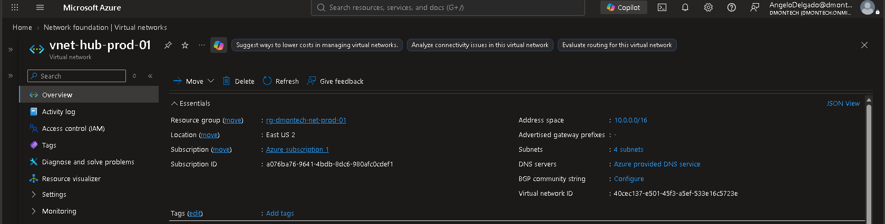
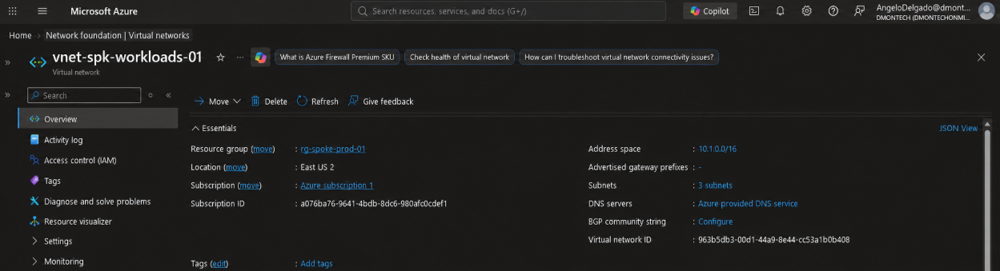
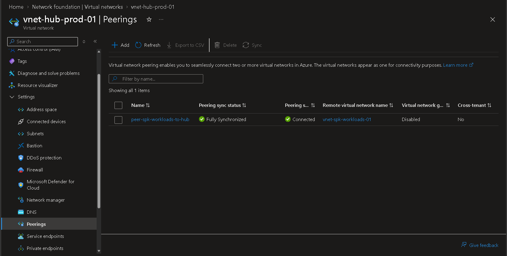

# 🌐 Phase 5 — Hub-and-Spoke Network Architecture

## 📌 Business Requirement

DmonTech operates four business locations across Costa Rica and is transitioning toward a hybrid cloud architecture. The Azure network requires workload isolation while maintaining centralized connectivity and security controls.

A **Hub-and-Spoke topology** was implemented to separate shared network services from production workloads and provide a scalable foundation for services such as Azure Firewall, VPN Gateway, Azure Bastion, and centralized routing.

---

## 🎯 Objective

Design and implement a scalable Azure Hub-and-Spoke network architecture that:

- Separates shared infrastructure from production workloads.
- Provides private connectivity between Hub and Spoke networks.
- Centralizes network security and routing capabilities.
- Supports future hybrid connectivity with the on-premises environment.
- Provides a foundation for additional Azure workload networks.

---

## 🏗️ Network Architecture

The Azure network is divided into two primary Virtual Networks.

### Hub Virtual Network

| Property | Value |
|---|---|
| Name | `vnet-hub-prod-01` |
| Resource Group | `rg-dmontech-net-prod-01` |
| Region | `East US 2` |
| Address Space | `10.0.0.0/16` |
| Purpose | Shared network and connectivity services |

The Hub VNet provides the centralized network layer for services such as Azure Firewall, VPN Gateway, Bastion, and shared connectivity components.

### 📸 Hub VNet Evidence



*Azure Hub Virtual Network `vnet-hub-prod-01` deployed in East US 2 with the `10.0.0.0/16` address space.*

---

### Spoke Virtual Network

| Property | Value |
|---|---|
| Name | `vnet-spk-workloads-01` |
| Resource Group | `rg-spoke-prod-01` |
| Region | `East US 2` |
| Address Space | `10.1.0.0/16` |
| Purpose | Production workloads |

The Spoke VNet provides an isolated network boundary for application and compute workloads while relying on the Hub for centralized network services.

### 📸 Spoke VNet Evidence



*Production Spoke Virtual Network `vnet-spk-workloads-01` deployed in `rg-spoke-prod-01` with the `10.1.0.0/16` address space.*

---

## 🔗 Hub-and-Spoke Connectivity

Virtual Network Peering was configured between:

```text
vnet-hub-prod-01
        │
        │ VNet Peering
        │
        ▼
vnet-spk-workloads-01
```

The peering relationship provides private connectivity between both networks using the Azure backbone without requiring public IP communication.

The configured peering reports:

- **Peering Status:** `Connected`
- **Peering Sync Status:** `Fully Synchronized`
- **Remote VNet:** `vnet-spk-workloads-01`
- **Cross-Tenant Peering:** `No`

### 📸 VNet Peering Evidence



*Hub-to-Spoke VNet peering successfully established between `vnet-hub-prod-01` and `vnet-spk-workloads-01`.*

---

## 🧠 Architectural Decisions

### Why Hub-and-Spoke?

Deploying all Azure resources inside a single Virtual Network would simplify the initial environment but reduce scalability, segmentation, and centralized network control.

DmonTech therefore separates the architecture into:

```text
                    Azure
                      │
              ┌───────┴───────┐
              │               │
              ▼               ▼
        Hub Network       Spoke Network
      10.0.0.0/16         10.1.0.0/16
              │               │
       Shared Services     Workloads
              │               │
              └──── Peering ──┘
```

This architecture provides:

- Centralized network services.
- Separation of shared infrastructure and workloads.
- Independent workload network management.
- Simplified security policy enforcement.
- Easier integration of additional Spoke VNets.
- A scalable foundation for hybrid connectivity.

---

## 🔐 Security Architecture

The Hub-and-Spoke model establishes the network foundation for a defense-in-depth architecture.

Security responsibilities are distributed across multiple layers:

```text
On-Premises
     │
     │ VPN
     ▼
┌─────────────────────┐
│         HUB         │
│   10.0.0.0/16       │
│                     │
│ Azure Firewall      │
│ VPN Gateway         │
│ Bastion             │
└──────────┬──────────┘
           │
           │ VNet Peering
           ▼
┌─────────────────────┐
│        SPOKE        │
│   10.1.0.0/16       │
│                     │
│ Application Subnets│
│ NSGs                │
│ Workload VMs        │
└─────────────────────┘
```

The Hub provides centralized connectivity and security services, while the Spoke maintains workload-level isolation.

Additional controls such as **Azure Firewall, User Defined Routes, Network Security Groups, VPN Gateway, and private connectivity** are implemented in the following networking stages.

---

## ✅ Validation

The Hub-and-Spoke network foundation was successfully validated.

| Validation | Status |
|---|---|
| Hub VNet deployed | ✅ Completed |
| Spoke VNet deployed | ✅ Completed |
| Non-overlapping address spaces | ✅ Validated |
| Hub-to-Spoke peering | ✅ Connected |
| Peering synchronization | ✅ Fully Synchronized |
| Private VNet connectivity foundation | ✅ Completed |
| Workload network separated from shared services | ✅ Completed |

The resulting network provides the connectivity foundation required by the remaining Azure infrastructure components.

---

## 📚 Lessons Learned

Hub-and-Spoke architecture provides significantly greater flexibility than placing all Azure resources inside a single Virtual Network.

Separating shared connectivity services from application workloads creates clear network boundaries and makes it possible to introduce additional security and routing controls without redesigning the workload network.

The implementation also reinforced the importance of **address-space planning and resource organization**. Non-overlapping CIDR ranges and dedicated Resource Groups allow Hub and Spoke resources to be managed independently while remaining part of the same enterprise network architecture.

---

## 🏁 Result

DmonTech now has a functional Azure Hub-and-Spoke network foundation consisting of:

- `vnet-hub-prod-01` — centralized Hub network.
- `vnet-spk-workloads-01` — isolated production workload network.
- `10.0.0.0/16` and `10.1.0.0/16` non-overlapping address spaces.
- Active VNet Peering between Hub and Spoke.
- A scalable network foundation for Azure Firewall, routing, VPN connectivity, Bastion, Private DNS, and future Spoke networks.

This architecture establishes the core Azure networking layer used throughout the remaining DmonTech infrastructure.