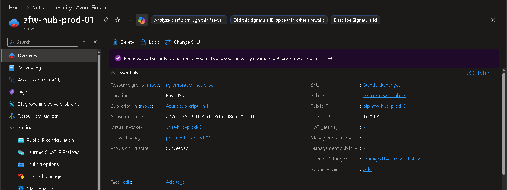
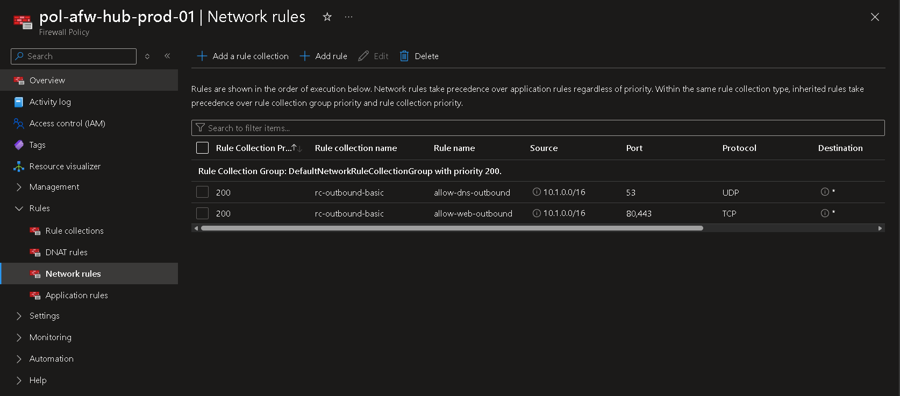

# 🔥 Phase 5 — Azure Firewall Deployment

## 📌 Business Requirement

As DmonTech migrates production workloads to Azure, outbound network traffic requires centralized security enforcement instead of relying exclusively on direct Internet connectivity from individual workload subnets.

Azure Firewall was deployed in the Hub network to provide a centralized inspection and policy enforcement point for the Spoke environment.

---

## 🎯 Objective

Deploy **Azure Firewall Standard** inside the Hub Virtual Network and implement centralized outbound network rules for production workloads located in the Spoke network.

---

## 🏗️ Firewall Architecture

| Property | Value |
|---|---|
| Firewall Name | `afw-hub-prod-01` |
| SKU | Standard |
| Region | East US 2 |
| Resource Group | `rg-dmontech-net-prod-01` |
| Virtual Network | `vnet-hub-prod-01` |
| Firewall Subnet | `AzureFirewallSubnet` |
| Private IP | `10.0.1.4` |
| Firewall Policy | `pol-afw-hub-prod-01` |

Azure Firewall was centralized in the Hub network so that security policy can be shared by workloads located in connected Spoke networks.

---

## 🌐 Firewall Subnet Design

The Hub address space reserves dedicated network capacity for Azure Firewall infrastructure.

| Subnet | Address Range | Purpose |
|---|---|---|
| `AzureFirewallSubnet` | `10.0.1.0/26` | Azure Firewall data plane |
| `AzureFirewallManagementSubnet` | `10.0.1.64/26` | Reserved management subnet capacity |

The Azure Firewall data plane uses `AzureFirewallSubnet`, while dedicated address space was reserved in the Hub design for management-related firewall infrastructure.

---

## 🔐 Firewall Policy

Centralized rule management was implemented through:

`pol-afw-hub-prod-01`

The policy contains the following network rule collection:

| Property | Value |
|---|---|
| Rule Collection Group | `DefaultNetworkRuleCollectionGroup` |
| Rule Collection | `rc-outbound-basic` |
| Priority | `200` |
| Action | Allow |

This separates firewall policy management from the firewall resource itself and provides a centralized location for network security rules.

---

## 📋 Network Rules

### DNS Outbound

| Property | Value |
|---|---|
| Rule Name | `allow-dns-outbound` |
| Source | `10.1.0.0/16` |
| Destination | Any |
| Protocol | UDP |
| Port | 53 |

This rule permits DNS traffic originating from the Spoke address space.

### Web Outbound

| Property | Value |
|---|---|
| Rule Name | `allow-web-outbound` |
| Source | `10.1.0.0/16` |
| Destination | Any |
| Protocol | TCP |
| Ports | 80, 443 |

This rule permits HTTP and HTTPS traffic required by workloads in the production Spoke network.

---

## 🧠 Architectural Decisions

### Centralized Firewall Placement

Azure Firewall was deployed in `vnet-hub-prod-01` rather than directly inside the workload Spoke.

This design establishes the Hub as the centralized network security layer while keeping application workloads isolated inside `vnet-spk-workloads-01`.

The architecture provides:

- Centralized network policy enforcement
- Separation between security infrastructure and application workloads
- Reusable security controls for future Spoke networks
- Simplified network administration
- A scalable foundation for additional workload environments

### Standard SKU

Azure Firewall Standard was selected because it provides the network filtering capabilities required for the scope of the lab without introducing unnecessary Premium features.

---

## 🔄 Integration with Spoke Routing

Azure Firewall uses the private address:

`10.0.1.4`

This address serves as the **Virtual Appliance next hop** for the Spoke User Defined Route (UDR).

The resulting traffic path is:

```text
Spoke Workload
      |
      v
snet-app-01
      |
      v
User Defined Route
0.0.0.0/0
      |
      v
Azure Firewall
10.0.1.4
      |
      v
Firewall Policy
      |
      v
Allowed Destination
```

The corresponding route configuration is documented separately in `03-Route-Tables.md`.

---

## 📸 Deployment Evidence

### Azure Firewall



*Azure Firewall `afw-hub-prod-01` deployed in `vnet-hub-prod-01` using the Standard SKU, associated with `pol-afw-hub-prod-01`, and assigned private IP address `10.0.1.4`.*

### Firewall Network Rules



*Firewall Policy network rules allowing DNS (UDP/53) and web traffic (TCP/80,443) from the Spoke address space `10.1.0.0/16`.*

---

## ✅ Validation

The implementation was validated through the Azure portal:

- Azure Firewall deployment completed successfully.
- Provisioning state reported `Succeeded`.
- Firewall deployed inside `vnet-hub-prod-01`.
- Private IP `10.0.1.4` assigned.
- Firewall Policy `pol-afw-hub-prod-01` associated.
- Network rule collection `rc-outbound-basic` configured.
- DNS outbound rule configured for UDP/53.
- Web outbound rule configured for TCP/80 and TCP/443.
- Spoke address space `10.1.0.0/16` configured as the rule source.

---

## 🔐 Security Considerations

Azure Firewall provides the centralized security layer of the Hub-and-Spoke architecture.

Combined with Network Security Groups and User Defined Routes, the design applies multiple network security controls:

- **Azure Firewall:** centralized traffic inspection and policy enforcement.
- **NSGs:** subnet-level traffic filtering.
- **UDRs:** controlled traffic forwarding through the centralized firewall.
- **VNet Peering:** private connectivity between Hub and Spoke networks.

This defense-in-depth model reduces reliance on any single network security control.

---

## 📚 Lessons Learned

Azure Firewall deployment requires careful subnet and routing planning before workloads are redirected through the security appliance.

The implementation demonstrated that deploying the firewall alone does not enforce centralized inspection. The firewall must be combined with appropriate **Firewall Policy rules** and **User Defined Routes** to establish the intended traffic path.

Separating firewall infrastructure into the Hub also creates a cleaner architecture than deploying independent security appliances inside each workload network.