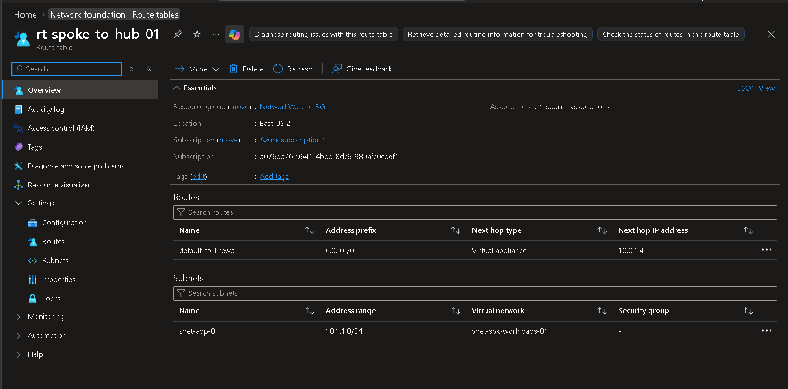
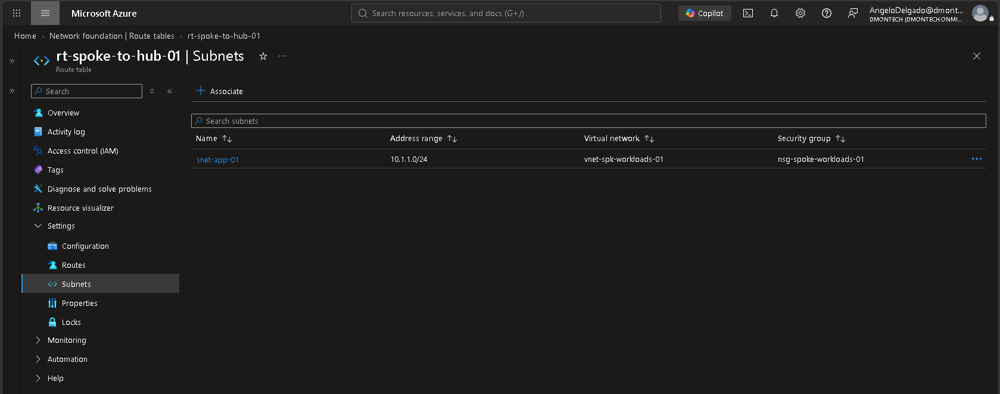

# 🛣️ Phase 5 — User Defined Routes & Forced Traffic Inspection

## 📌 Business Requirement

DmonTech requires production workloads in the Spoke network to use a centralized network security path rather than relying exclusively on Azure's default routing behavior.

To enforce this architecture, outbound traffic from the workload subnet is redirected toward **Azure Firewall** in the Hub network before reaching external destinations.

---

## 🎯 Objective

Implement a **User Defined Route (UDR)** on the production workload subnet to establish Azure Firewall as the next hop for outbound traffic.

This provides a controlled traffic path between Spoke workloads and external networks.

---

## 🏗️ Route Table Configuration

| Property | Value |
|---|---|
| Route Table | `rt-spoke-to-hub-01` |
| Region | East US 2 |
| Associated VNet | `vnet-spk-workloads-01` |
| Associated Subnet | `snet-app-01` |
| Subnet Address Range | `10.1.1.0/24` |

The route table is associated directly with the application workload subnet so that its custom routing configuration applies to resources deployed within that subnet.

---

## 📋 User Defined Route

A default route was configured to redirect outbound traffic toward the centralized Azure Firewall.

| Property | Value |
|---|---|
| Route Name | `default-to-firewall` |
| Destination Prefix | `0.0.0.0/0` |
| Next Hop Type | Virtual Appliance |
| Next Hop IP Address | `10.0.1.4` |

The next-hop address corresponds to the private IP assigned to `afw-hub-prod-01`.

---

## 🔄 Traffic Flow

The resulting routing path is:

```text
Workload
   |
   v
snet-app-01
10.1.1.0/24
   |
   v
rt-spoke-to-hub-01
   |
   | 0.0.0.0/0
   v
Virtual Appliance
10.0.1.4
   |
   v
Azure Firewall
afw-hub-prod-01
   |
   v
Firewall Policy
   |
   v
Allowed Destination
```

The route `0.0.0.0/0` overrides the normal Internet-bound path for resources affected by the route table and directs matching traffic to Azure Firewall as a virtual appliance.

---

## 🔐 Security Rationale

Without the custom route, workloads can rely on Azure system routes for outbound connectivity.

The UDR establishes an explicit security path through the Hub firewall infrastructure.

This supports:

- Centralized traffic inspection
- Centralized network policy enforcement
- Controlled outbound connectivity
- Consistent routing across workloads
- Reusable routing for future Spoke networks
- Defense-in-depth networking

The route table therefore works together with Azure Firewall rather than acting as a security control by itself.

---

## 🛡️ Layered Network Security

The workload subnet combines multiple networking controls:

```text
                    Spoke
                      |
                      v
               snet-app-01
                /         \
               /           \
              v             v
     nsg-spoke-workloads-01
                            |
                            v
                  rt-spoke-to-hub-01
                            |
                            v
                    Azure Firewall
                      10.0.1.4
```

Each component has a different responsibility:

- **NSG:** filters traffic at the workload subnet level.
- **Route Table:** determines the required network path.
- **Azure Firewall:** performs centralized traffic filtering and policy enforcement.
- **VNet Peering:** provides private connectivity between the Spoke and Hub networks.

This separation of responsibilities provides a more scalable architecture than relying on a single network security mechanism.

---

## 🧠 Architectural Decisions

### Default Route Through Azure Firewall

The destination prefix `0.0.0.0/0` was selected so that Internet-bound traffic matching the route is forwarded toward the centralized firewall.

Azure Firewall's private IP `10.0.1.4` was configured as the next hop using the **Virtual Appliance** next-hop type.

### Subnet-Level Association

The route table was associated with `snet-app-01` rather than individual virtual machines.

This allows routing policy to be applied consistently to workloads deployed inside the subnet without requiring per-VM route configuration.

### Centralized Hub Routing

Routing security services through the Hub creates a reusable architecture for future Spoke networks.

Additional workload networks can adopt the same model:

```text
Spoke A ──┐
          |
Spoke B ──┼──> Hub ──> Azure Firewall
          |
Spoke C ──┘
```

This allows network security infrastructure to remain centralized as the Azure environment expands.

---

## 📸 Deployment Evidence

### Route Table and Default Route



*Route table `rt-spoke-to-hub-01` configured with the `default-to-firewall` route, forwarding `0.0.0.0/0` traffic to Azure Firewall private IP `10.0.1.4` through the Virtual Appliance next-hop type.*

### Workload Subnet Association



*Route table associated with `snet-app-01` (`10.1.1.0/24`) inside `vnet-spk-workloads-01`. The workload subnet is additionally protected by `nsg-spoke-workloads-01`.*

---

## ✅ Validation

The implementation was validated through the Azure portal:

- Route table `rt-spoke-to-hub-01` successfully deployed.
- Route `default-to-firewall` configured.
- Destination prefix set to `0.0.0.0/0`.
- Next hop configured as `Virtual Appliance`.
- Azure Firewall private IP `10.0.1.4` configured as the next hop.
- Route table associated with `snet-app-01`.
- Subnet confirmed inside `vnet-spk-workloads-01`.
- NSG `nsg-spoke-workloads-01` confirmed on the workload subnet.

---

## 📚 Lessons Learned

User Defined Routes are a critical component of centralized network security because deploying Azure Firewall alone does not automatically place the firewall in the traffic path.

The routing layer must explicitly direct the required traffic toward the firewall.

The implementation also demonstrated the distinction between **routing and filtering**: the route table determines where traffic goes, while Azure Firewall and NSGs determine which traffic is permitted.

Combining VNet Peering, UDRs, Azure Firewall, and NSGs creates a modular Hub-and-Spoke network architecture that can be extended as additional workloads and Spoke networks are introduced.