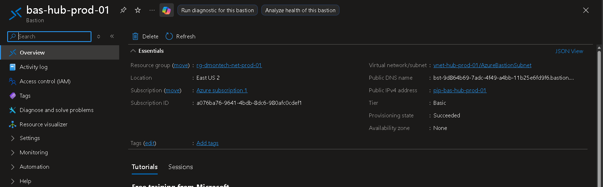
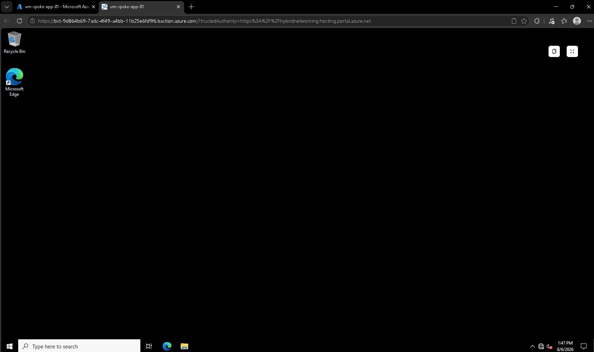
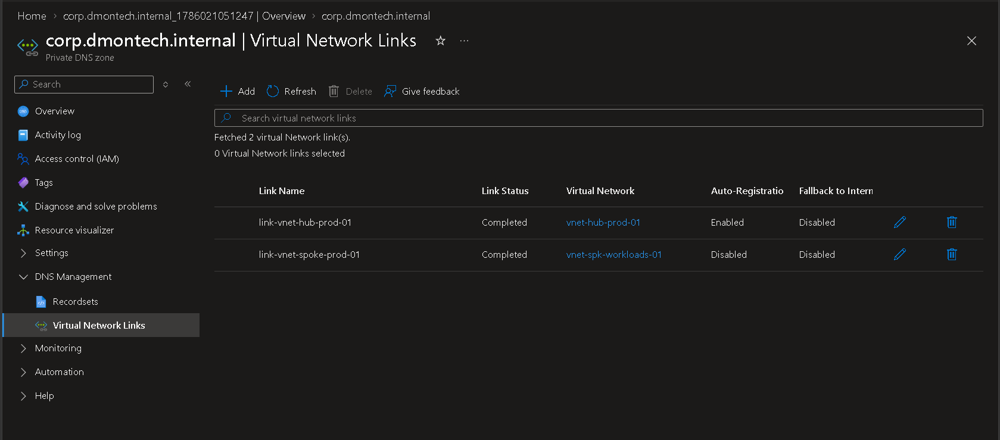
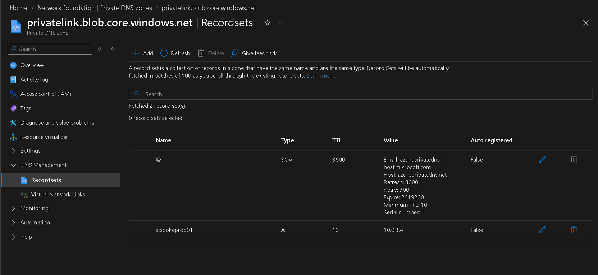

# 🔐 Phase 5 — Azure Bastion & Private DNS

---

# 📌 Business Requirement

DmonTech requires secure administrative access to Azure workloads without exposing virtual machines directly to the Internet.

The environment also requires private DNS resolution for internal resources and Azure services accessed through private networking.

Azure Bastion and Azure Private DNS were implemented to provide secure management connectivity and centralized private name resolution across the Hub-and-Spoke architecture.

---

# 🎯 Objective

Implement secure administrative access to private Azure workloads using Azure Bastion and configure Private DNS Zones to support internal name resolution across the Hub-and-Spoke environment.

The implementation was designed to:

- Avoid direct RDP exposure of workload virtual machines.
- Centralize administrative connectivity through the Hub network.
- Provide private DNS resolution between Azure virtual networks.
- Support private Azure service endpoints.
- Maintain network segmentation while enabling centralized services.

---

# 🏗️ Architecture Overview

The implemented design follows:

```text
                    Azure
                      |
              vnet-hub-prod-01
                      |
        +-------------+-------------+
        |                           |
        v                           v
 Azure Bastion              Private DNS
 bas-hub-prod-01         corp.dmontech.internal
        |                           |
        |                     VNet Links
        |                     /         \
        |                    /           \
        +---------- Peering ------------+
                     |
                     v
            vnet-spk-workloads-01
                     |
                     v
              Private Workloads
```

Azure Bastion provides the administrative access path, while Azure Private DNS provides internal name-resolution capabilities.

---

# 🛡️ Azure Bastion

## Bastion Deployment

Azure Bastion was deployed in the Hub Virtual Network to provide centralized administrative access to workloads.

| Setting | Value |
|---|---|
| Bastion Name | `bas-hub-prod-01` |
| Resource Group | `rg-dmontech-net-prod-01` |
| Region | East US 2 |
| Virtual Network | `vnet-hub-prod-01` |
| Subnet | `AzureBastionSubnet` |
| SKU | Basic |
| Public IP | `pip-bas-hub-prod-01` |
| Provisioning State | Succeeded |

Azure Bastion resides in its dedicated `AzureBastionSubnet` within the Hub network.

This allows administrative connectivity to private workloads without requiring direct inbound RDP exposure on the workload virtual machines.

---

## Administrative Access Flow

The implemented access path follows:

```text
Administrator
     |
     | HTTPS
     v
Azure Portal
     |
     v
Azure Bastion
bas-hub-prod-01
     |
     | Private Azure Networking
     v
Hub-Spoke Peering
     |
     v
vm-spoke-app-01
```

The administrator initiates the connection through Azure Bastion rather than connecting directly to the workload through a public RDP endpoint.

This provides a centralized management access layer for private Azure resources.

---

# 🔐 Bastion Security Benefits

Using Azure Bastion provides several security advantages:

- Workload VMs do not require direct public RDP exposure.
- Administrative access is centralized through the Hub.
- RDP connectivity occurs through Azure-managed Bastion infrastructure.
- Backend workloads remain reachable through private networking.
- Administrative access can traverse the Hub-and-Spoke topology.
- The attack surface associated with exposing TCP/3389 directly to the Internet is reduced.

This design supports DmonTech's defense-in-depth and Zero Trust networking strategy.

---

# 🧪 Bastion Validation

Azure Bastion was validated by establishing an administrative RDP session to the workload VM:

```text
vm-spoke-app-01
```

The connection was successfully initiated through:

```text
bas-hub-prod-01
```

and the Windows Server desktop was successfully reached through the browser-based Bastion session.

### Bastion Deployment



*Azure Bastion `bas-hub-prod-01` deployed in `vnet-hub-prod-01` using the dedicated `AzureBastionSubnet`.*

### Bastion RDP Validation



*Successful browser-based RDP session to `vm-spoke-app-01` through Azure Bastion.*

---

# 🌐 Azure Private DNS

## Internal DNS Zone

A Private DNS Zone was configured for internal Azure name resolution:

```text
corp.dmontech.internal
```

The zone was linked to both the Hub and Spoke virtual networks.

| Virtual Network | Link | Status | Auto-Registration |
|---|---|---|---|
| `vnet-hub-prod-01` | `link-vnet-hub-prod-01` | Completed | Enabled |
| `vnet-spk-workloads-01` | `link-vnet-spoke-prod-01` | Completed | Disabled |

Linking the Private DNS Zone to both networks allows resources participating in the Hub-and-Spoke architecture to use the private DNS namespace.

Auto-registration was enabled for the Hub VNet, allowing eligible resources within that linked network to automatically register DNS records in the zone.

### Private DNS VNet Links



*The `corp.dmontech.internal` Private DNS Zone linked to the Hub and Spoke virtual networks.*

---

# 🔒 Private Link DNS Zone

A second Private DNS Zone was configured for Azure Blob Storage Private Link resolution:

```text
privatelink.blob.core.windows.net
```

This namespace is used by Azure Private Link to provide private DNS resolution for Blob Storage resources accessed through private endpoints.

The configured zone contained the following private record:

| Record | Type | Private IP |
|---|---|---|
| `stspokeprod01` | A | `10.0.3.4` |

The record maps the private service name to an internal Azure IP address rather than a public endpoint.

Conceptually:

```text
Azure Workload
      |
      | DNS Query
      v
Private DNS Zone
privatelink.blob.core.windows.net
      |
      v
stspokeprod01
      |
      v
10.0.3.4
```

This demonstrates the DNS component required for private service access through Azure Private Link.

### Private Link DNS Record



*Private `A` record configured in `privatelink.blob.core.windows.net`, mapping `stspokeprod01` to `10.0.3.4`.*

---

# 🧠 Architectural Decisions

## Why Deploy Bastion in the Hub?

Azure Bastion was deployed in the Hub because administrative connectivity is a shared infrastructure service.

Centralizing Bastion avoids unnecessarily deploying separate administrative access infrastructure for each Spoke network.

The Hub therefore acts as the centralized location for services such as:

- Azure Bastion
- Azure Firewall
- VPN connectivity
- Shared networking services

while application workloads remain isolated in Spoke networks.

---

## Why Use Private DNS?

Private IP connectivity alone does not provide a complete private service architecture.

Applications normally connect to services using DNS names rather than hard-coded IP addresses.

Azure Private DNS therefore provides the name-resolution layer required to map private service names to private IP addresses.

This becomes particularly important when using Azure Private Link and Private Endpoints.

---

# 🔐 Security Architecture

The combined design provides multiple security layers:

```text
                  Administrative Access
                           |
                           v
                    Azure Bastion
                           |
                           v
                    Hub Network
                           |
                    VNet Peering
                           |
                           v
                    Spoke Network
                           |
                           v
                  Private Workloads


                  Service Resolution
                           |
                           v
                   Private DNS Zone
                           |
                           v
                    Private Record
                           |
                           v
                     Private IP
```

Azure Bastion protects the management plane by avoiding direct administrative exposure of workload VMs.

Private DNS supports private service communication by resolving internal service names to private Azure addresses.

Together, these services reinforce the separation between public access, administrative connectivity, and private workload communication.

---

# 💰 Cost Management

Azure Bastion was deployed to validate the architecture and administrative connectivity during the lab.

Because persistent Bastion infrastructure generates ongoing Azure consumption, the resource can be removed after implementation, validation, and evidence collection when it is no longer required for the laboratory.

The implementation lifecycle therefore follows:

```text
Design
   |
   v
Deploy
   |
   v
Configure
   |
   v
Validate
   |
   v
Document
   |
   v
Remove Temporary High-Cost Resources
```

Private DNS Zones can remain available because they provide the logical DNS configuration required by the architecture with substantially lower resource overhead than continuously running management infrastructure.

---

# ✅ Validation Summary

The following capabilities were successfully implemented and validated:

| Capability | Status |
|---|---|
| Azure Bastion deployment | Completed |
| Dedicated `AzureBastionSubnet` | Completed |
| Bastion Basic SKU | Completed |
| Hub-based administrative access | Completed |
| RDP session through Azure Bastion | Completed |
| Private workload access | Completed |
| `corp.dmontech.internal` Private DNS Zone | Completed |
| Hub VNet DNS link | Completed |
| Spoke VNet DNS link | Completed |
| Hub auto-registration | Enabled |
| Private Link DNS Zone | Completed |
| Blob Storage private DNS record | Completed |
| Private IP DNS mapping | Completed |

---

# 📚 Lessons Learned

Azure Bastion provides a secure alternative to exposing administrative ports directly on Azure virtual machines.

Deploying Bastion in the Hub allows the service to operate as centralized management infrastructure within a Hub-and-Spoke architecture.

Private DNS is equally important when implementing private networking because private connectivity must also be accompanied by appropriate name resolution.

The implementation demonstrated that Azure networking security involves more than traffic filtering. Secure enterprise networking requires coordination between connectivity, routing, administrative access, DNS resolution, and private service integration.

---

# 🏁 Result

DmonTech successfully implemented centralized administrative access and private DNS infrastructure within its Azure Hub-and-Spoke environment.

The final architecture included:

- Azure Bastion Basic.
- Dedicated `AzureBastionSubnet`.
- Browser-based RDP connectivity to private workloads.
- Hub-based centralized administrative access.
- `corp.dmontech.internal` Private DNS namespace.
- Hub and Spoke Virtual Network links.
- DNS auto-registration on the Hub link.
- `privatelink.blob.core.windows.net` Private DNS Zone.
- Private `A` record resolution to `10.0.3.4`.
- Integration with the existing Hub-and-Spoke networking architecture.

These components extend the DmonTech network architecture beyond basic connectivity by providing secure management access and private DNS capabilities for enterprise workloads.