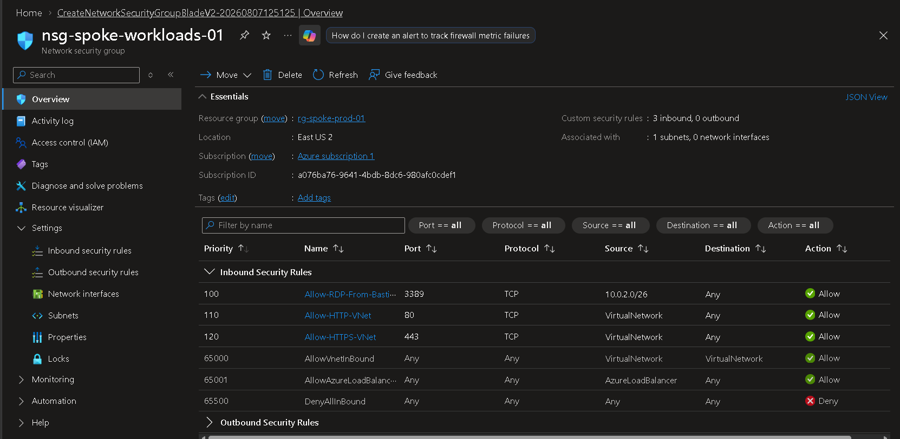
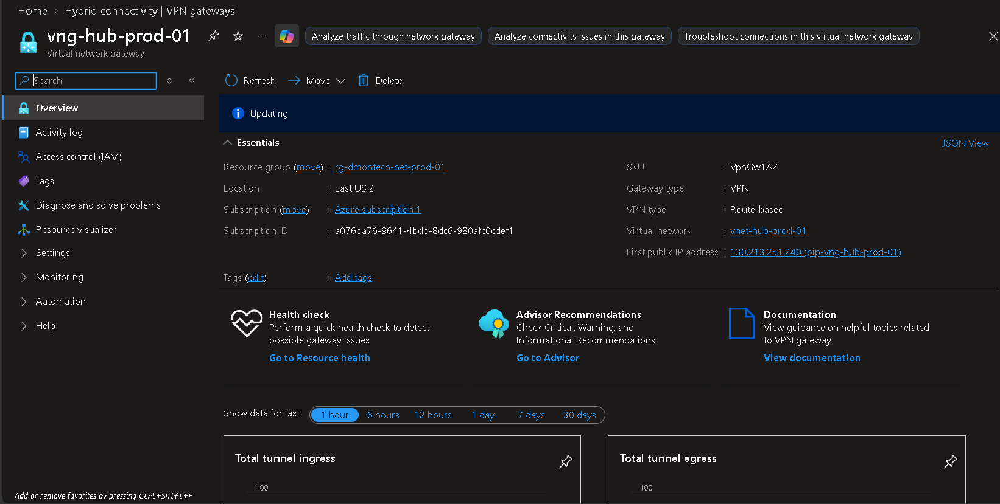
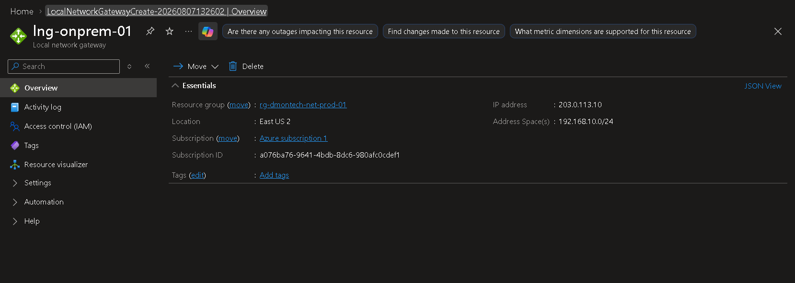
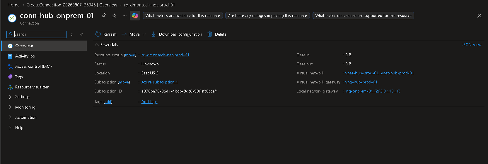

# Network Security

## Overview

As part of the DmonTech hybrid infrastructure, additional network security controls were implemented to strengthen the Azure networking architecture. The objective was to enforce layered security by combining Network Security Groups (NSGs) with Azure VPN Gateway, providing both network segmentation and secure hybrid connectivity capabilities.

This implementation follows Microsoft's defense-in-depth and Zero Trust recommendations by applying security controls at different layers of the network.

---

# Business Requirements

The organization required:

- Restrict traffic entering workload subnets.
- Prevent unnecessary exposure of virtual machines.
- Prepare the environment for secure hybrid connectivity between Azure and the on-premises infrastructure.
- Centralize network security while maintaining subnet-level protection.
- Build a scalable networking architecture suitable for future branch offices.

---

# Solution Overview

The following components were implemented:

- Network Security Group (NSG)
- Virtual Network Gateway
- Local Network Gateway
- Site-to-Site VPN Connection

Although the Site-to-Site VPN was not connected to a real on-premises VPN appliance, the Azure infrastructure was fully configured and ready for future hybrid connectivity.

---

# Network Security Group (NSG)

## Objective

The Network Security Group provides subnet-level traffic filtering by allowing or denying inbound and outbound traffic based on security rules.

Within this project, the NSG was associated with the workload subnet to provide an additional layer of protection on top of Azure Firewall.

## Implementation

Resource Name

```
nsg-spoke-workloads-01
```

Associated Subnet

```
snet-app-01
```

Inbound rules were created to allow only the required administrative and application traffic while preventing unnecessary exposure.

The NSG was associated directly with the workload subnet, protecting all resources deployed inside it.

---

# Azure VPN Gateway

## Objective

The Azure VPN Gateway prepares the environment for secure communication between Azure and the on-premises datacenter.

Although the on-premises VPN device was not implemented in this lab, the Azure side of the infrastructure was fully configured.

## Components

Virtual Network Gateway

```
vng-hub-prod-01
```

Local Network Gateway

```
lng-onprem-01
```

Connection

```
conn-hub-onprem-01
```

VPN Type

```
Route-Based
```

The connection remained in an unconnected state because no physical VPN appliance or compatible software gateway was deployed on-premises.

This is expected behavior for this laboratory.

---

# Validation

The following validations were performed:

- NSG successfully deployed.
- NSG associated with the workload subnet.
- VPN Gateway successfully provisioned.
- Local Network Gateway created.
- Site-to-Site VPN connection successfully configured.
- Azure accepted the complete VPN configuration.

---

# Security Considerations

The design follows a layered security approach.

Security responsibilities are divided between multiple Azure services:

- Azure Firewall performs centralized traffic inspection.
- NSGs provide subnet-level filtering.
- Route Tables enforce traffic flow through the security layer.
- VPN Gateway enables secure hybrid connectivity.

This architecture minimizes unnecessary network exposure while remaining scalable for future expansion.

---

# Lessons Learned

Implementing multiple security layers provides greater flexibility than relying on a single security control.

Network Security Groups complement Azure Firewall by protecting individual subnets, while Azure VPN Gateway enables secure connectivity with external networks without exposing internal workloads directly to the Internet.

Building the Azure side of a Site-to-Site VPN before deploying the on-premises gateway simplifies future hybrid integration projects.

---

# Screenshots

-Network Security Group 

-Azure VPN Gateway

-Local Network Gateway

-Site-to-Site VPN Connection
