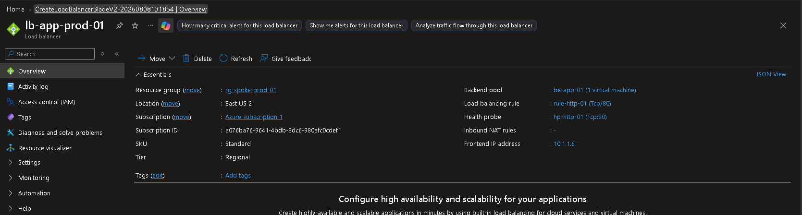
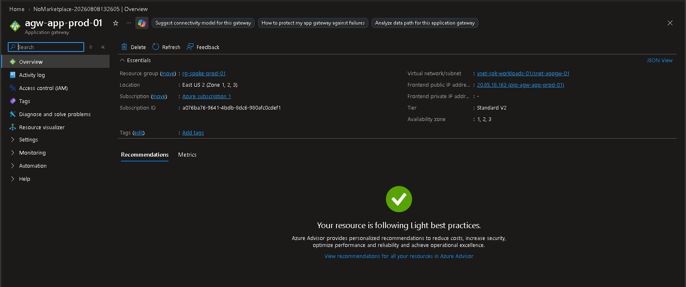

# ⚖️ Phase 5 — Azure Load Balancing and Application Delivery

---

# 📌 Business Requirement

As DmonTech expands its Azure environment, application workloads require scalable traffic distribution mechanisms that can support both internal services and web-facing applications.

The organization requires technologies capable of distributing traffic across backend workloads while maintaining separation between application delivery infrastructure and production compute resources.

Azure Load Balancer and Azure Application Gateway were implemented to demonstrate Layer 4 and Layer 7 traffic distribution within the Azure environment.

---

# 🎯 Objective

Deploy and configure Azure-native load-balancing services to demonstrate two different application delivery models:

- Layer 4 TCP traffic distribution using Azure Load Balancer.
- Layer 7 HTTP application delivery using Azure Application Gateway.
- Private frontend connectivity for internal workloads.
- Dedicated networking for Application Gateway.
- Backend health monitoring.
- Integration with the existing Spoke workload network.

The services were deployed independently to demonstrate their respective capabilities rather than being unnecessarily chained together.

---

# 🏗️ Architecture Overview

The implementation included:

| Component | Resource |
|---|---|
| Azure Load Balancer | `lb-app-prod-01` |
| Load Balancer SKU | Standard |
| Load Balancer Type | Internal |
| Backend Pool | `be-app-01` |
| Health Probe | `hp-http-01` |
| Load Balancing Rule | `rule-http-01` |
| Application Gateway | `agw-app-prod-01` |
| Application Gateway SKU | Standard_v2 |
| Application Gateway Subnet | `snet-appgw-01` |
| Application Gateway Public IP | `pip-agw-app-prod-01` |
| Virtual Network | `vnet-spk-workloads-01` |

Both services were deployed in `rg-spoke-prod-01` in East US 2.

---

# 🔄 Azure Load Balancer

## Internal Load Balancer

Azure Standard Load Balancer was deployed to demonstrate private Layer 4 traffic distribution inside the Spoke environment.

| Property | Value |
|---|---|
| Name | `lb-app-prod-01` |
| Resource Group | `rg-spoke-prod-01` |
| Region | East US 2 |
| SKU | Standard |
| Tier | Regional |
| Type | Internal |
| Frontend IP | `10.1.1.6` |
| Backend Pool | `be-app-01` |
| Backend Instances | 1 |
| Health Probe | `hp-http-01` |
| Load Balancing Rule | `rule-http-01` |

The Load Balancer used a private frontend IP address rather than exposing the workload directly to the Internet.

---

# 🌐 Private Frontend

The Load Balancer frontend was configured with the private address:

```text
10.1.1.6
```

The resulting traffic model is:

```text
Internal Client
      |
      v
10.1.1.6
      |
      v
Azure Load Balancer
lb-app-prod-01
      |
      v
be-app-01
      |
      v
Application Workload
```

Because the frontend is private, the Load Balancer provides internal application delivery without requiring a public-facing endpoint.

---

# 🖥️ Backend Pool

The backend pool was configured as:

```text
be-app-01
```

During the lab, the backend pool contained one virtual machine.

The backend pool defines the compute resources eligible to receive traffic distributed through the Load Balancer.

In a production deployment, additional backend instances could be added to provide greater scalability and availability.

---

# ❤️ Health Probe

A health probe was configured to monitor backend availability.

| Setting | Value |
|---|---|
| Probe | `hp-http-01` |
| Protocol | TCP |
| Port | 80 |

The probe allows Azure Load Balancer to determine whether a backend instance is capable of receiving TCP connections on port 80.

In a multi-instance production deployment, unhealthy backend instances can be excluded from new traffic distribution until they become healthy again.

---

# 📋 Load Balancing Rule

The following load-balancing rule was configured:

| Setting | Value |
|---|---|
| Rule | `rule-http-01` |
| Protocol | TCP |
| Frontend Port | 80 |
| Backend Port | 80 |
| Backend Pool | `be-app-01` |
| Health Probe | `hp-http-01` |

The configuration demonstrates Layer 4 traffic distribution based on TCP connectivity.

Azure Load Balancer does not inspect HTTP application content when making its forwarding decisions.

---

# 📸 Azure Load Balancer Evidence



*Azure Standard Load Balancer `lb-app-prod-01` configured with private frontend `10.1.1.6`, backend pool `be-app-01`, TCP/80 health probe `hp-http-01`, and TCP/80 load-balancing rule `rule-http-01`.*

---

# 🌍 Azure Application Gateway

## Application Gateway Deployment

Azure Application Gateway was deployed to demonstrate Layer 7 application delivery for HTTP-based workloads.

| Property | Value |
|---|---|
| Name | `agw-app-prod-01` |
| Resource Group | `rg-spoke-prod-01` |
| Region | East US 2 |
| SKU | Standard_v2 |
| Virtual Network | `vnet-spk-workloads-01` |
| Dedicated Subnet | `snet-appgw-01` |
| Frontend Type | Public |
| Public IP Resource | `pip-agw-app-prod-01` |
| Availability Zones | 1, 2, 3 |

Unlike the internal Load Balancer, the Application Gateway was configured with a public frontend for the laboratory implementation.

Backend workloads themselves did not require direct public IP addresses.

---

# 🏗️ Dedicated Application Gateway Subnet

Application Gateway was deployed into its own dedicated subnet:

```text
snet-appgw-01
```

The network design separates application delivery infrastructure from application workloads:

```text
vnet-spk-workloads-01
        |
        +---------------------------+
        |                           |
        v                           v
   snet-app-01                snet-appgw-01
        |                           |
        v                           v
Application Workloads       Application Gateway
                            agw-app-prod-01
```

This separation provides a cleaner network architecture and allows the Application Gateway infrastructure to be managed independently from backend compute resources.

---

# 🌐 Public Frontend

Application Gateway was configured with the public IP resource:

```text
pip-agw-app-prod-01
```

The public frontend provides an Internet-reachable entry point while allowing backend workloads to remain privately addressed.

Conceptually:

```text
Internet
    |
    v
Public Frontend
pip-agw-app-prod-01
    |
    v
Application Gateway
agw-app-prod-01
    |
    v
Private Backend Workload
```

This architecture separates public application delivery from the backend workload itself.

---

# 🧠 Layer 7 Application Delivery

Application Gateway operates at Layer 7 and is designed specifically for HTTP and HTTPS workloads.

Unlike Azure Load Balancer, Application Gateway understands web application traffic and can support capabilities such as:

- HTTP/HTTPS listeners
- Host-based routing
- Path-based routing
- TLS termination
- Backend health monitoring
- Cookie-based session affinity
- Web Application Firewall when using a WAF-enabled SKU

The lab used the Standard_v2 SKU to demonstrate the core Application Gateway architecture without deploying the WAF SKU.

---

# 📸 Azure Application Gateway Evidence



*Azure Application Gateway `agw-app-prod-01` deployed using Standard_v2 in `vnet-spk-workloads-01/snet-appgw-01`, with a public frontend and Availability Zones 1, 2, and 3.*

---

# ⚖️ Azure Load Balancer vs Application Gateway

The project demonstrates two different Azure traffic distribution technologies.

| Capability | Azure Load Balancer | Application Gateway |
|---|---|---|
| OSI Layer | Layer 4 | Layer 7 |
| Primary Protocols | TCP / UDP | HTTP / HTTPS |
| Routing Awareness | IP + Port | HTTP application traffic |
| Backend Health Monitoring | Health Probes | Backend Health Probes |
| Private Frontend | Supported | Supported depending on configuration |
| Public Frontend | Supported | Supported |
| HTTP-aware Routing | No | Yes |
| Path-based Routing | No | Yes |
| Host-based Routing | No | Yes |
| TLS Termination | No | Yes |
| Web Application Firewall | No | Available with WAF SKU |

Azure Load Balancer is appropriate when traffic needs to be distributed primarily according to transport-layer connectivity.

Application Gateway is designed for web application delivery and provides HTTP-aware capabilities that are unavailable with a Layer 4 Load Balancer.

---

# 🧠 Architectural Decisions

## Why an Internal Load Balancer?

The Load Balancer was configured with a private frontend because its purpose was to demonstrate internal workload distribution.

This prevents unnecessary Internet exposure and provides an architecture suitable for internal applications and services.

---

## Why Application Gateway?

Application Gateway was selected to demonstrate Layer 7 application delivery.

While Azure Load Balancer distributes TCP and UDP connections, Application Gateway provides application-aware functionality specifically designed for HTTP and HTTPS workloads.

---

## Why a Dedicated Subnet?

Application Gateway infrastructure was isolated in `snet-appgw-01` rather than being deployed alongside application workloads.

This separation:

- Provides cleaner network segmentation.
- Separates application delivery infrastructure from compute.
- Simplifies management.
- Supports independent scaling.
- Prevents unrelated workloads from sharing Application Gateway subnet capacity.

---

## Why Standard_v2?

Standard_v2 was sufficient for demonstrating Application Gateway architecture and Layer 7 application delivery within the scope of the lab.

A production Internet-facing application requiring web application firewall capabilities could instead use the WAF_v2 SKU.

---

# 🛡️ Security Considerations

Several security principles were incorporated into the design:

- Azure Load Balancer used a private frontend.
- Backend workloads used private IP addressing.
- Application Gateway was isolated in a dedicated subnet.
- Workload and application delivery infrastructure remained separated.
- Network Security Groups protected the workload subnet.
- Public exposure was introduced at the Application Gateway frontend rather than directly on backend workloads.
- The Standard_v2 lab deployment did not include Web Application Firewall functionality.

This maintains separation between the public application delivery layer and private backend compute resources.

---

# 🔗 Relationship with the Existing Network Architecture

The load-balancing services complement the networking controls implemented throughout the project.

```text
                    DmonTech Azure Network
                            |
          +-----------------+-----------------+
          |                                   |
          v                                   v
 Internal Application                  Web Application
          |                                   |
          v                                   v
Azure Load Balancer              Application Gateway
lb-app-prod-01                    agw-app-prod-01
          |                                   |
          | Layer 4                           | Layer 7
          v                                   v
          +------------ Spoke Workloads ------+
```

They were deployed independently because each service demonstrates a different traffic distribution requirement.

There is no architectural requirement to place Azure Load Balancer behind Application Gateway simply because both technologies exist in the environment.

---

# 💰 Cost Management

Azure Load Balancer and Application Gateway were deployed as laboratory resources for configuration and architectural validation.

Application delivery infrastructure can generate ongoing Azure consumption even when used only for demonstration purposes.

The project therefore followed the same temporary-resource lifecycle used throughout the Azure lab:

```text
Design
   |
   v
Deploy
   |
   v
Configure
   |
   v
Validate
   |
   v
Document
   |
   v
Remove Temporary Resource
```

This approach allows enterprise Azure technologies to be implemented and documented without maintaining unnecessary long-term laboratory costs.

---

# ✅ Validation

The following configuration was successfully validated:

| Capability | Status |
|---|---|
| Azure Standard Load Balancer | Completed |
| Internal Load Balancer Frontend | Completed |
| Private Frontend `10.1.1.6` | Completed |
| Backend Pool `be-app-01` | Completed |
| Backend VM Association | Completed |
| TCP/80 Health Probe | Completed |
| TCP/80 Load Balancing Rule | Completed |
| Azure Application Gateway | Completed |
| Standard_v2 SKU | Completed |
| Dedicated `snet-appgw-01` Subnet | Completed |
| Public Frontend | Completed |
| Availability Zones 1, 2, 3 | Completed |
| Integration with Spoke Network | Completed |
| Layer 4 Architecture | Completed |
| Layer 7 Architecture | Completed |

The implementation validates the configuration and architecture of both Azure traffic distribution services.

---

# 📚 Lessons Learned

Azure Load Balancer and Azure Application Gateway address different application delivery requirements and should not be treated as interchangeable services.

Azure Load Balancer operates at Layer 4 and provides high-performance TCP and UDP traffic distribution without interpreting application-layer content.

Application Gateway operates at Layer 7 and provides web-specific functionality for HTTP and HTTPS applications.

The implementation also demonstrated the importance of subnet planning. Application Gateway requires dedicated subnet capacity, meaning application delivery requirements should be considered during the initial VNet address-space design.

Using a private Load Balancer frontend also demonstrated how internal applications can benefit from traffic distribution without introducing unnecessary public exposure.

Finally, temporary deployment and cleanup of higher-cost Azure services provides a practical way to gain implementation experience while maintaining control over laboratory consumption.

---

# 🏁 Result

The DmonTech Azure environment successfully demonstrated both Layer 4 and Layer 7 application delivery architectures.

The implementation included:

- Azure Standard Internal Load Balancer.
- Private frontend addressing.
- Backend pool configuration.
- TCP health monitoring.
- TCP load-balancing rules.
- Azure Application Gateway Standard_v2.
- Dedicated Application Gateway subnet.
- Public Application Gateway frontend.
- Availability Zone-aware deployment.
- Integration with the existing Spoke workload network.

Together, these services demonstrate how Azure provides different traffic distribution mechanisms depending on application requirements while maintaining separation between frontend application delivery infrastructure and backend workloads.