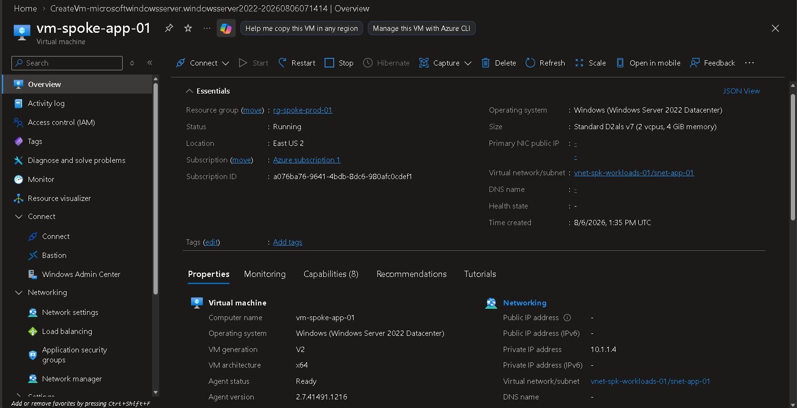
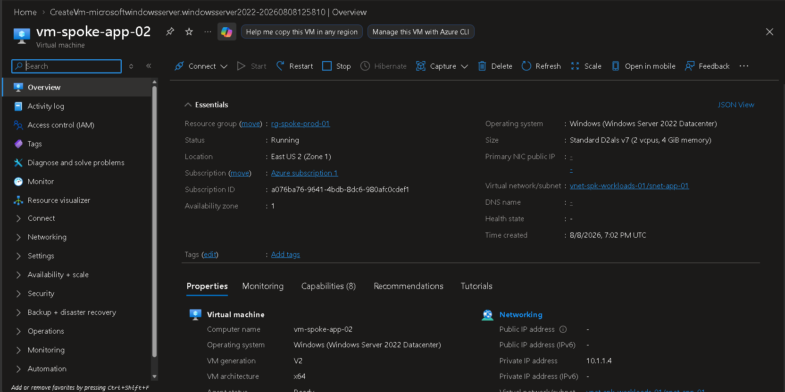
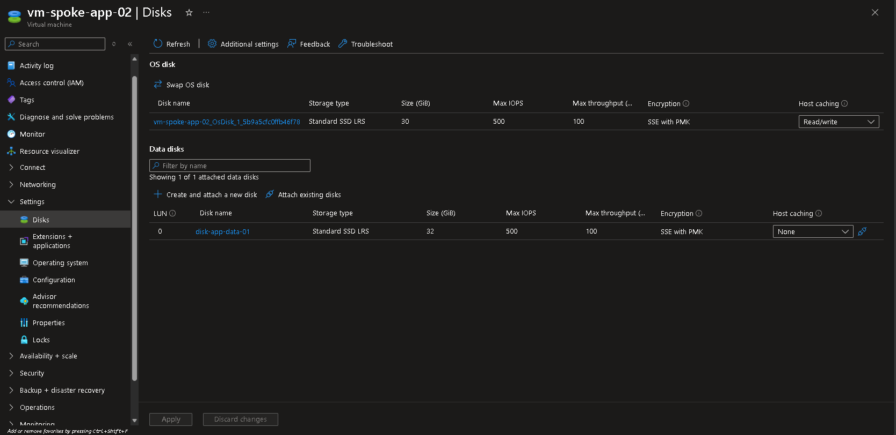
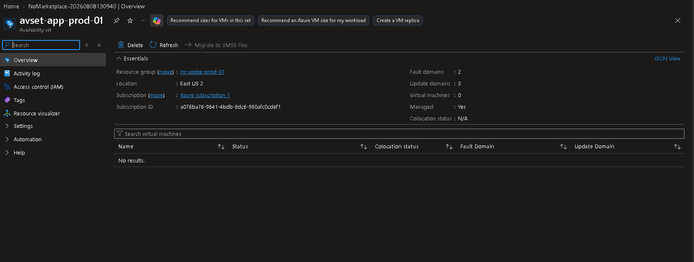
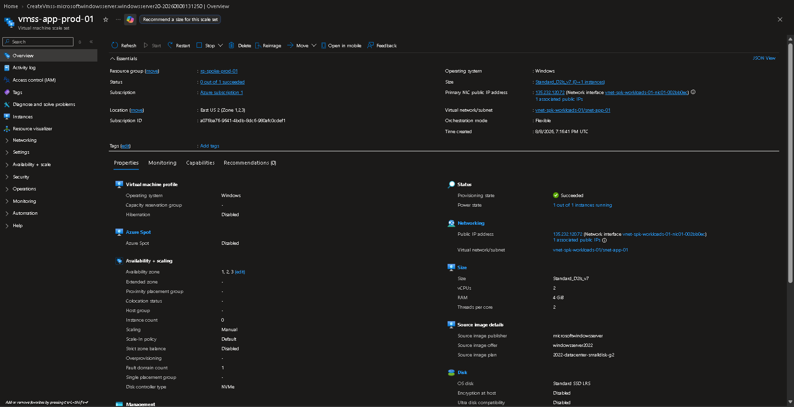

# 🖥️ Phase 6 — Spoke Workload Deployment

---

## 📌 Business Requirement

DmonTech requires a dedicated compute layer for production workloads while maintaining separation from centralized networking and security services hosted in the Hub.

Application workloads must remain isolated inside the Spoke network, avoid unnecessary direct Internet exposure, and integrate with the existing Azure Firewall, Network Security Groups, User Defined Routes, and Azure Bastion architecture.

The environment must also demonstrate multiple Azure compute availability and scalability models suitable for enterprise workloads.

---

## 🎯 Objective

Deploy and validate Azure compute resources inside the production Spoke network while demonstrating:

- Private Windows Server virtual machines.
- Availability Zone placement.
- Azure Managed Disks.
- Availability Sets.
- Virtual Machine Scale Sets.
- Integration with the existing Hub-and-Spoke architecture.
- Centralized network security and administrative access.

---

## 🏗️ Compute Architecture

The compute environment was deployed inside the production Spoke network.

| Property | Value |
|---|---|
| Resource Group | `rg-spoke-prod-01` |
| Region | East US 2 |
| Virtual Network | `vnet-spk-workloads-01` |
| Workload Subnet | `snet-app-01` |
| Spoke Address Space | `10.1.0.0/16` |
| Workload Subnet | `10.1.1.0/24` |

The resulting architecture follows:

```text
                    Azure Hub
                        |
        +---------------+---------------+
        |                               |
        v                               v
 Azure Firewall                   Azure Bastion
 afw-hub-prod-01                 bas-hub-prod-01
        |                               |
        +---------------+---------------+
                        |
                 VNet Peering
                        |
                        v
              vnet-spk-workloads-01
                        |
                    snet-app-01
                        |
          +-------------+-------------+
          |             |             |
          v             v             v
 vm-spoke-app-01 vm-spoke-app-02 vmss-app-prod-01
                        |
                        v
                disk-app-data-01
```

This design keeps application compute inside the Spoke while shared networking and security services remain centralized in the Hub.

---

## 🖥️ Primary Workload Virtual Machine

The first application workload deployed in the Spoke was:

`vm-spoke-app-01`

| Property | Value |
|---|---|
| Virtual Machine | `vm-spoke-app-01` |
| Resource Group | `rg-spoke-prod-01` |
| Region | East US 2 |
| Operating System | Windows Server 2022 Datacenter |
| VM Size | `Standard_D2als_v7` |
| Virtual Network | `vnet-spk-workloads-01` |
| Subnet | `snet-app-01` |
| Private IP | `10.1.1.4` |
| Public IP | None |

The virtual machine was intentionally deployed without a public IP address.

Administrative connectivity is provided through Azure Bastion rather than exposing RDP directly to the Internet.

### 📸 Primary VM Evidence



*`vm-spoke-app-01` deployed inside `snet-app-01` using private addressing and no public IP.*

---

## 🌐 Spoke Network Integration

The workload VMs are connected to:

```text
vnet-spk-workloads-01
        |
        v
snet-app-01
```

The subnet is protected by:

`nsg-spoke-workloads-01`

and associated with:

`rt-spoke-to-hub-01`

The route table contains the following default route:

| Property | Value |
|---|---|
| Route | `default-to-firewall` |
| Destination | `0.0.0.0/0` |
| Next Hop Type | Virtual Appliance |
| Next Hop IP | `10.0.1.4` |

The next-hop address corresponds to the private IP of:

`afw-hub-prod-01`

The resulting outbound traffic path is:

```text
Workload VM
     |
     v
snet-app-01
     |
     v
rt-spoke-to-hub-01
     |
     | 0.0.0.0/0
     v
Azure Firewall
10.0.1.4
     |
     v
Allowed Destination
```

This integrates the compute layer with the centralized security architecture implemented in the Hub.

---

## 🖥️ Secondary Workload Virtual Machine

A second Windows Server workload was deployed to demonstrate zone-aware compute:

`vm-spoke-app-02`

| Property | Value |
|---|---|
| Virtual Machine | `vm-spoke-app-02` |
| Resource Group | `rg-spoke-prod-01` |
| Region | East US 2 |
| Availability Zone | Zone 1 |
| Operating System | Windows Server 2022 Datacenter |
| VM Size | `Standard_D2als_v7` |
| Virtual Network | `vnet-spk-workloads-01` |
| Subnet | `snet-app-01` |
| Public IP | None |

### 📸 Secondary VM Evidence



*Secondary application workload `vm-spoke-app-02` deployed inside the production Spoke.*

---

## 🌎 Availability Zone

`vm-spoke-app-02` was explicitly deployed in **Availability Zone 1** within East US 2.

Availability Zones provide physically separated datacenter infrastructure within an Azure region.

A zone-aware architecture can distribute workloads across independent infrastructure boundaries to reduce the impact of datacenter-level failures.

Conceptually:

```text
                  East US 2
                      |
          +-----------+-----------+
          |           |           |
          v           v           v
        Zone 1      Zone 2      Zone 3
          |
          v
 vm-spoke-app-02
```

### 📸 Availability Zone Evidence


*`vm-spoke-app-02` deployed in East US 2 Availability Zone 1.*

---

## 💾 Azure Managed Disk

An additional Managed Disk was attached to `vm-spoke-app-02` to separate application data from the operating system disk.

| Property | Value |
|---|---|
| Disk Name | `disk-app-data-01` |
| Storage Type | Standard SSD LRS |
| Size | 32 GiB |
| LUN | 0 |
| Max IOPS | 500 |
| Max Throughput | 100 MB/s |
| Encryption | SSE with PMK |
| Host Caching | None |
| Attached VM | `vm-spoke-app-02` |

The resulting storage model is:

```text
vm-spoke-app-02
       |
       +-------------------+
       |                   |
       v                   v
    OS Disk         disk-app-data-01
                         32 GiB
```

Separating workload data from the operating system disk provides greater flexibility for storage management, resizing, backup, and workload lifecycle operations.

Storage Service Encryption with platform-managed keys protects the disk data at rest.

### 📸 Managed Disk Evidence



*Standard SSD LRS data disk `disk-app-data-01` attached to `vm-spoke-app-02`.*

---

## 🏢 Availability Set

An Azure Availability Set was created to demonstrate the traditional Azure VM resiliency model:

`avset-app-prod-01`

| Property | Value |
|---|---|
| Availability Set | `avset-app-prod-01` |
| Resource Group | `rg-spoke-prod-01` |
| Region | East US 2 |
| Fault Domains | 2 |
| Update Domains | 3 |
| Managed | Yes |

Availability Sets distribute participating virtual machines across **Fault Domains** and **Update Domains**.

### Fault Domains

Fault Domains provide logical separation across underlying infrastructure that can experience independent hardware, power, or network failures.

### Update Domains

Update Domains separate participating virtual machines during planned Azure platform maintenance.

The Availability Set was deployed as an architectural demonstration and does not contain the zone-based workload VM.

Availability Sets and Availability Zones were therefore demonstrated independently.

### 📸 Availability Set Evidence



*`avset-app-prod-01` configured with two Fault Domains and three Update Domains.*

---

## 📈 Virtual Machine Scale Set

A Virtual Machine Scale Set was deployed to demonstrate scalable application compute:

`vmss-app-prod-01`

| Property | Value |
|---|---|
| Scale Set | `vmss-app-prod-01` |
| Resource Group | `rg-spoke-prod-01` |
| Region | East US 2 |
| Operating System | Windows |
| VM Size | `Standard_D2als_v7` |
| Virtual Network | `vnet-spk-workloads-01` |
| Subnet | `snet-app-01` |
| Orchestration Mode | Flexible |
| Scaling | Manual |
| Availability Zones | 1, 2, 3 |
| OS Disk | Standard SSD LRS |

Virtual Machine Scale Sets provide a platform for managing multiple VM instances as a scalable compute tier.

Conceptually:

```text
Application Demand
        |
        v
+----------------------+
| VM Scale Set         |
| vmss-app-prod-01     |
+----------------------+
        |
   +----+----+
   |         |
   v         v
Instance   Instance
```

Flexible orchestration provides greater control over individual VM instances while maintaining the management capabilities of a scale set.

### 📸 VM Scale Set Evidence



*`vmss-app-prod-01` deployed inside the Spoke workload network using Flexible orchestration.*

---

## 🔄 Availability & Scalability Strategy

The compute environment demonstrates several Azure deployment models:

| Technology | Purpose |
|---|---|
| Standalone VM | Individual application workload |
| Availability Zone | Datacenter-level infrastructure isolation |
| Availability Set | Fault and Update Domain distribution |
| VM Scale Set | Multi-instance scalable compute |
| Managed Disk | Independent persistent workload storage |

These technologies address different infrastructure requirements and were implemented independently where appropriate.

The objective was not to combine every availability technology into a single workload, but to demonstrate the architectural purpose and implementation of each Azure compute model.

---

## 🔐 Security Design

The compute layer integrates with the security controls established throughout the DmonTech architecture.

### Private Workloads

The standalone workload VMs were deployed without public IP addresses.

### Secure Administrative Access

Administrative connectivity is provided through Azure Bastion rather than exposing TCP/3389 directly to the Internet.

### Network Segmentation

Application workloads are isolated inside:

`vnet-spk-workloads-01/snet-app-01`

### Subnet-Level Protection

The workload subnet is protected by:

`nsg-spoke-workloads-01`

### Centralized Traffic Inspection

The User Defined Route sends Internet-bound workload traffic toward Azure Firewall:

```text
0.0.0.0/0
     |
     v
10.0.1.4
     |
     v
afw-hub-prod-01
```

### Encryption at Rest

Azure Managed Disks use Storage Service Encryption to protect persistent data.

Together, these controls create a layered security model around the compute environment.

---

## 🧠 Architectural Decisions

### Why Deploy Compute in the Spoke?

Application workloads were deployed in the Spoke instead of the Hub to maintain separation between workload compute and centralized infrastructure.

The Hub remains responsible for shared networking and security services, while the Spoke hosts application resources.

This provides:

- Clear workload isolation
- Centralized security services
- Easier network expansion
- Reduced infrastructure coupling
- Consistent security enforcement
- A scalable foundation for additional Spokes

### Why Use Availability Zones?

Availability Zones provide physical datacenter-level separation and represent the preferred resiliency model for supported workloads requiring zone-level protection.

### Why Demonstrate an Availability Set?

Availability Sets remain an important Azure compute concept and demonstrate Fault Domain and Update Domain distribution for workloads not using Availability Zones.

### Why Deploy a VM Scale Set?

VM Scale Sets demonstrate how the application tier can evolve beyond individually managed virtual machines into a multi-instance compute architecture capable of supporting horizontal scaling.

---

## 💰 Cost Management

Compute resources generate ongoing Azure consumption while provisioned and running.

Because DmonTech is implemented as a laboratory architecture, resources were managed using a controlled lifecycle:

```text
Design
   |
   v
Deploy
   |
   v
Configure
   |
   v
Validate
   |
   v
Document
   |
   v
Stop / Remove Temporary Resources
```

Additional cost considerations included:

- Appropriately sized VM SKUs.
- Standard SSD storage where Premium performance was unnecessary.
- No public IPs on standalone workload VMs.
- Manual VMSS scaling for the laboratory.
- Removal or shutdown of temporary compute resources after validation.

This approach allows enterprise Azure compute technologies to be demonstrated while controlling unnecessary laboratory consumption.

---

## ✅ Validation

The following compute capabilities were successfully implemented or demonstrated:

| Capability | Status |
|---|---|
| `vm-spoke-app-01` | Completed |
| `vm-spoke-app-02` | Completed |
| Private standalone VM deployment | Completed |
| Windows Server 2022 workloads | Completed |
| Spoke VNet integration | Completed |
| NSG protection | Completed |
| Centralized UDR architecture | Completed |
| Azure Bastion administration | Validated |
| Availability Zone deployment | Completed |
| `disk-app-data-01` | Completed |
| Managed Disk attachment | Completed |
| `avset-app-prod-01` | Completed |
| Fault / Update Domain configuration | Completed |
| `vmss-app-prod-01` | Completed |
| Flexible orchestration | Completed |

---

## 📚 Lessons Learned

Azure compute architecture requires more than simply deploying virtual machines.

Workload placement must be designed together with networking, routing, administrative access, storage, availability, scalability, security, and cost.

Availability Zones and Availability Sets address different resiliency models. Availability Zones provide physical datacenter separation, while Availability Sets distribute participating workloads across Fault and Update Domains.

Managed Disks provide independent persistent storage for application data, while Virtual Machine Scale Sets provide a foundation for multi-instance and horizontally scalable compute architectures.

Deploying these resources inside a dedicated Spoke also demonstrated the value of separating application workloads from centralized networking and security infrastructure.

---

## 🏁 Result

The DmonTech Azure environment successfully implemented a dedicated compute tier inside the production Spoke network.

The implementation included:

- Private Windows Server virtual machines.
- Availability Zone deployment.
- Azure Managed Disks.
- Availability Set architecture.
- Fault and Update Domains.
- Virtual Machine Scale Set.
- Flexible orchestration.
- NSG-protected workload networking.
- Centralized routing through Azure Firewall.
- Secure administrative access through Azure Bastion.
- Integration with the existing Hub-and-Spoke architecture.

The resulting environment demonstrates how Azure compute workloads can be deployed with network isolation, centralized security, availability, scalability, and storage considerations while maintaining a consistent enterprise architecture.