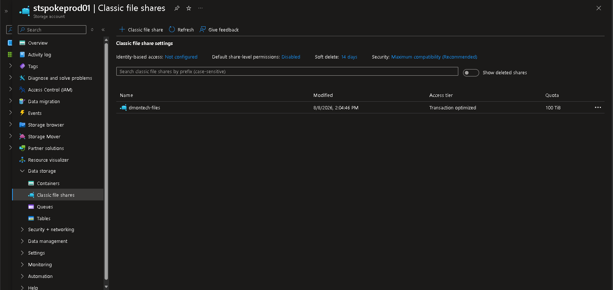
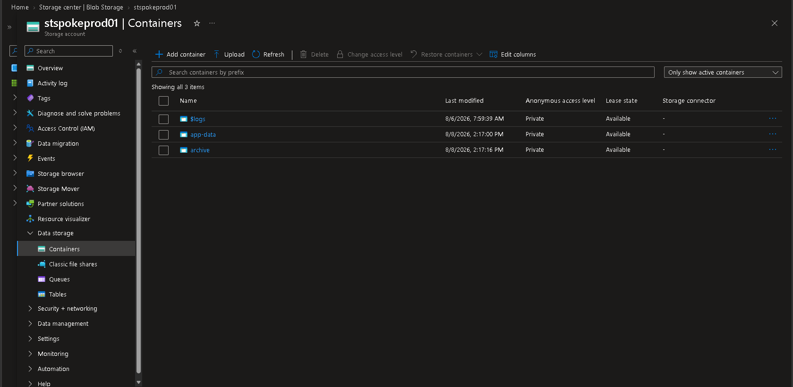
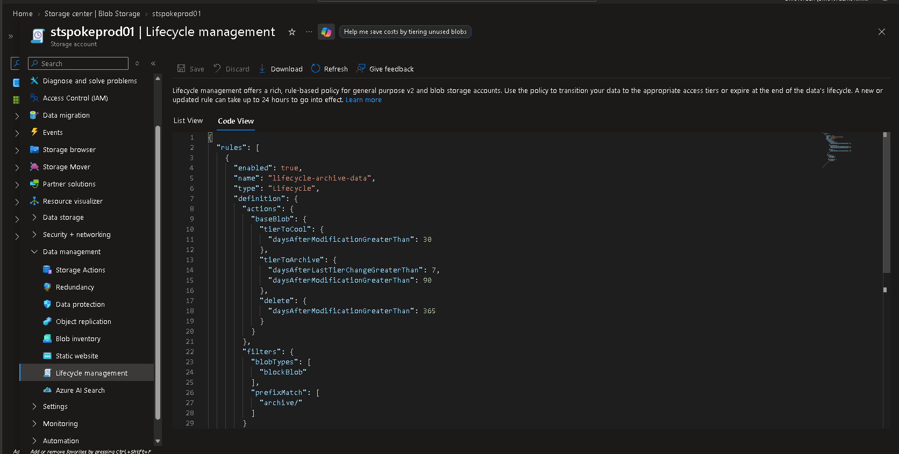

# Secure Azure Storage Architecture

## Executive Summary

This document describes the implementation of the storage layer for the DmonTech Azure environment.

The solution was designed around three primary objectives:

- Restrict storage exposure and maintain private connectivity.
- Provide multiple storage services for different workload requirements.
- Implement automated data lifecycle management to optimize long-term storage costs.

The final implementation combines Azure Storage, Private Link, Private DNS, Azure Blob Storage, Azure Files, and Lifecycle Management within the Spoke architecture.

---

## 1. Storage Account

The primary storage resource deployed for the DmonTech environment was:

| Setting | Value |
|---|---|
| Storage Account | `stspokeprod01` |
| Resource Group | `rg-spoke-prod-01` |
| Performance | Standard |
| Redundancy | LRS |
| Public Network Access | Disabled |

The storage account provides the centralized storage platform for Blob and Azure Files workloads.

Public network access was disabled as part of the security design, preventing direct data-plane connectivity from the public Internet.

---

## 2. Private Endpoint

A Private Endpoint was deployed to provide private connectivity to the Blob service.

### Configuration

| Setting | Value |
|---|---|
| Private Endpoint | `pe-stspokeprod01-blob` |
| Target Resource | `stspokeprod01` |
| Target Sub-resource | Blob |
| Connectivity | Private Link |
| Public Access | Disabled |

Private Endpoint connectivity allows clients inside the Azure network to reach the storage service through a private IP address rather than through its public endpoint.

This supports the broader Zero Trust design by reducing unnecessary public exposure of storage resources.

---

## 3. Private DNS Integration

Private DNS was integrated with the Storage Account Private Endpoint.

The following Private DNS Zone was used:

```text
privatelink.blob.core.windows.net
```

The Private Endpoint integration creates the required private DNS resolution path so that requests for the Storage Account Blob endpoint resolve to its internal Private Endpoint address.

The resulting connectivity model is:

```text
Azure Workload
      |
      v
Spoke VNet
      |
      v
Private DNS
      |
      v
Private Endpoint
      |
      v
Azure Storage
```

This keeps storage traffic within the Azure private networking architecture.

---

# Storage Services

## 4. Azure Files

Azure Files was implemented to demonstrate managed SMB file storage within the DmonTech environment.

The following file share was created:

| Setting | Value |
|---|---|
| File Share | `dmontech-files` |
| Storage Account | `stspokeprod01` |
| Access Tier | Transaction optimized |
| Quota | 100 TiB |
| Soft Delete | 14 days |

Azure Files provides managed file shares without requiring the organization to deploy and maintain a traditional Windows file server.

The service can support workloads that require shared file access while benefiting from Azure Storage availability and management capabilities.

### Azure Files Evidence



*Azure Files share `dmontech-files` configured within the DmonTech Storage Account.*

---

## 5. Blob Storage

Blob Storage was configured to provide object storage for application and archival data.

Two containers were created:

| Container | Purpose | Public Access |
|---|---|---|
| `app-data` | Application and operational data | Private |
| `archive` | Long-term archival data | Private |

Anonymous access was disabled for both containers.

Separating active application data from archival data allows different lifecycle and retention strategies to be applied according to the purpose of the stored information.

### Blob Storage Evidence



*Private Blob containers `app-data` and `archive` configured within `stspokeprod01`.*

---

## 6. Storage Lifecycle Management

Azure Storage Lifecycle Management was implemented to automatically transition archival data between storage tiers as it ages.

The policy created for the project was:

```text
lifecycle-archive-data
```

The policy applies specifically to Block Blobs using the prefix:

```text
archive/
```

This prevents the lifecycle policy from affecting application data stored outside the archival container.

---

## 7. Lifecycle Policy

The following lifecycle strategy was implemented:

| Data Age | Action |
|---|---|
| More than 30 days | Move to Cool tier |
| More than 90 days | Move to Archive tier |
| More than 365 days | Delete blob |

The lifecycle progression therefore follows:

```text
Archive Container
       |
       v
    Hot Tier
       |
    30 Days
       |
       v
    Cool Tier
       |
    90 Days
       |
       v
  Archive Tier
       |
   365 Days
       |
       v
     Delete
```

This provides automated cost optimization without requiring administrators to manually move old data between storage tiers.

### Lifecycle Management Evidence

<!-- SCREENSHOT 3: Lifecycle Management JSON showing Cool 30 / Archive 90 / Delete 365 -->



*Lifecycle policy `lifecycle-archive-data` automatically transitioning archival blobs through Cool and Archive tiers before deletion.*

---

## 8. Lifecycle Policy Scope

The lifecycle rule was intentionally limited using the following prefix filter:

```text
archive/
```

This ensures that the policy targets archival data rather than every Blob stored within the Storage Account.

For example:

```text
stspokeprod01
│
├── app-data
│   └── Operational application data
│
└── archive
    │
    ├── 0-30 days
    │      Hot
    │
    ├── 30-90 days
    │      Cool
    │
    ├── 90-365 days
    │      Archive
    │
    └── >365 days
           Delete
```

This separation allows operational data and archival data to follow different storage strategies.

---

## 9. Security Architecture

The Storage Account was designed around restricted access and workload isolation.

Key security controls include:

- Public network access disabled.
- Private Endpoint connectivity.
- Private DNS integration.
- Private Blob containers.
- Anonymous Blob access disabled.
- Azure RBAC for authorization.
- Network-level isolation through the Spoke architecture.

The resulting security model is:

```text
Internet
   X
   |
   |
Azure Workload
      |
      v
Spoke VNet
      |
      v
Private Endpoint
      |
      v
stspokeprod01
      |
      +----------------+
      |                |
      v                v
 Azure Files       Blob Storage
                    |
             +------+------+
             |             |
             v             v
         app-data        archive
                           |
                           v
                   Lifecycle Policy
```

This architecture reduces direct exposure of the storage layer while providing different storage services for workload requirements.

---

## 10. Cost Optimization

Storage cost optimization was incorporated directly into the architecture.

The Lifecycle Management policy automatically moves aging archival data toward lower-cost storage tiers:

```text
Frequently accessed
       |
       v
      Hot
       |
       v
      Cool
       |
       v
    Archive
       |
       v
     Delete
```

This approach is preferable to storing all data indefinitely in a frequently accessed storage tier.

The architecture therefore considers both technical storage requirements and long-term cloud consumption.

---

## 11. Operational Considerations

The storage implementation demonstrates several operational principles:

- Different storage services should be selected according to workload requirements.
- Storage should not be publicly accessible unless there is a specific business requirement.
- Private Link can provide private data-plane connectivity to Azure PaaS services.
- Private DNS is required to provide transparent name resolution for Private Endpoint resources.
- Blob containers should remain private by default.
- Lifecycle policies can automate storage cost optimization.
- Archival and operational data should be logically separated when they require different retention strategies.

---

## 12. Validation Summary

The following storage capabilities were implemented:

| Capability | Status |
|---|---|
| Azure Storage Account | Completed |
| Standard LRS Storage | Completed |
| Public Network Access Disabled | Completed |
| Private Endpoint | Completed |
| Private DNS Integration | Completed |
| Azure Files | Completed |
| Blob Storage | Completed |
| Private Blob Containers | Completed |
| Lifecycle Management | Completed |
| Cool Tier Transition | Configured |
| Archive Tier Transition | Configured |
| Automatic Deletion | Configured |

---

## 13. Lessons Learned

Azure Storage provides multiple services within a common storage platform, but each service addresses different workload requirements.

Azure Files provides managed shared file storage, while Blob Storage provides scalable object storage suitable for application data, logs, backups, and archival information.

Private Endpoint integration significantly changes the security model by allowing Azure Storage to operate without relying on public network connectivity.

Lifecycle Management also demonstrates that cloud architecture is not only about deploying infrastructure. Data placement and retention decisions directly affect long-term operational costs.

Combining private connectivity, logical data separation, and automated lifecycle management creates a storage architecture that addresses security, operations, and cost simultaneously.

---

## Result

The DmonTech Azure environment successfully implemented a secure and cost-aware storage architecture.

The solution includes:

- Standard LRS Azure Storage.
- Private Endpoint connectivity.
- Private DNS integration.
- Azure Files.
- Private Blob containers.
- Separation between operational and archival data.
- Automated Lifecycle Management.
- Cool and Archive tier transitions.
- Automatic deletion of aged archival data.

Together, these components provide a storage platform designed around private connectivity, workload flexibility, security, and long-term cost optimization.