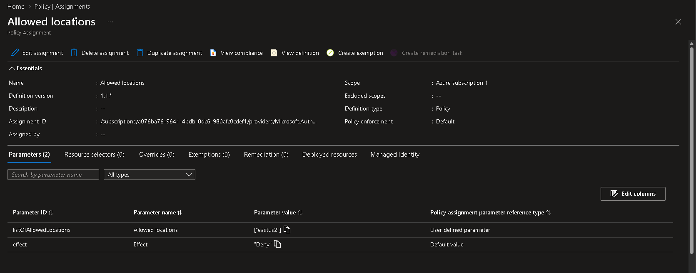

# 🛡️ Azure Policy Governance

## 📌 Business Requirement

DmonTech requires centralized governance controls to ensure that Azure resources are deployed according to organizational standards.

The organization requires:

- Standardized resource deployments.
- Restriction of Azure resource creation to approved regions.
- Reduced configuration drift.
- Improved governance across the Azure subscription.
- Prevention of accidental deployments in unsupported locations.
- A foundation for future compliance and auditing initiatives.

Without centralized policy enforcement, administrators could deploy resources into unintended Azure regions, resulting in inconsistent architecture, increased operational complexity, and potential compliance issues.

---

## 🎯 Objective

The objective of this implementation is to use Azure Policy to enforce regional deployment standards across the DmonTech Azure environment.

A built-in **Allowed locations** policy was assigned at the subscription level to restrict resource deployment to the organization's approved Azure region:

```text
East US 2
```

Resources targeting non-approved regions are automatically denied by Azure Policy.

---

## 🏗️ Architecture

Azure Policy provides a centralized governance layer that evaluates Azure resource deployments against predefined organizational rules.

The implemented governance model is:

```text
Azure Subscription
        |
        v
   Azure Policy
        |
        v
 Allowed locations
        |
        v
    East US 2
        |
   +----+----+
   |         |
   v         v
Compliant  Non-Compliant
   |         |
   v         v
 Allowed    Denied
```

The policy is assigned at the subscription scope, ensuring that applicable resource deployments within the subscription are evaluated against the regional restriction.

---

## ⚙️ Policy Configuration

The built-in Azure Policy definition **Allowed locations** was used.

| Setting | Value |
|---|---|
| Policy Assignment | `Allowed locations` |
| Definition Type | Built-in Policy |
| Scope | Azure Subscription |
| Allowed Location | `East US 2` |
| Parameter Value | `eastus2` |
| Effect | `Deny` |
| Policy Enforcement | Default |
| Excluded Scopes | None |
| Exemptions | None |

Using a built-in policy definition avoids unnecessary custom policy development while providing a Microsoft-maintained governance control for regional restrictions.

---

## 🛡️ Policy Enforcement

The policy uses the `Deny` effect.

When a deployment request targets a location outside the approved region, Azure Policy evaluates the request before resource creation and prevents the non-compliant deployment.

```text
Resource Deployment Request
           |
           v
    Azure Policy Evaluation
           |
     +-----+-----+
     |           |
     v           v
  East US 2   Other Region
     |           |
     v           v
   Allow        Deny
```

This converts the organization's regional deployment requirement from an administrative guideline into an enforceable technical control.

---

## 🔐 Governance

Azure Policy introduces centralized governance into the DmonTech Azure architecture.

Key governance controls include:

- Subscription-level policy assignment.
- Centralized regional restrictions.
- Automatic evaluation of resource deployments.
- Denial of non-compliant deployments.
- Consistent enforcement regardless of administrator.
- No policy exemptions configured.
- No excluded scopes configured.

This reduces reliance on administrators manually following deployment standards.

Instead, Azure itself enforces the required configuration.

---

## 📸 Evidence

### Allowed Locations Policy Assignment



*Azure Policy `Allowed locations` assigned at subscription scope with `eastus2` configured as the approved location and the `Deny` effect enabled.*

---

## 🧠 Architectural Decisions

### Subscription-Level Assignment

The policy was assigned at the Azure subscription level rather than to an individual Resource Group.

This provides broader governance coverage and ensures that applicable future deployments across the subscription inherit the regional restriction automatically.

### Built-In Policy Definition

The Microsoft built-in **Allowed locations** policy was selected instead of creating a custom policy definition.

The existing policy already provides the required functionality and reduces unnecessary administrative complexity.

### Single Approved Region

`East US 2` was selected as the approved deployment region because the DmonTech Azure infrastructure was standardized around this region.

Maintaining a consistent primary region simplifies:

- Network architecture.
- Resource organization.
- Operational management.
- Troubleshooting.
- Cost analysis.
- Governance.

### Deny Enforcement

The `Deny` effect was selected instead of using an audit-only configuration.

An audit policy would identify non-compliant resources but would still allow them to be created.

Using `Deny` proactively prevents configuration drift before it occurs.

---

## 💰 Cost Management

Azure Policy governance can indirectly support cost management by preventing accidental resource deployments outside the organization's intended architecture.

Regional standardization helps reduce:

- Unplanned infrastructure deployment.
- Resource sprawl.
- Operational complexity.
- Accidental cross-region architectures.
- Unexpected networking patterns and associated costs.

The policy itself introduces governance without requiring dedicated infrastructure such as virtual machines or network appliances.

---

## ✅ Validation

The Azure Policy implementation was validated with the following configuration:

| Validation | Status |
|---|---|
| Azure Policy Assignment Created | ✅ Completed |
| Built-In `Allowed locations` Policy Used | ✅ Completed |
| Subscription Scope Applied | ✅ Completed |
| `East US 2` Allowed | ✅ Configured |
| `Deny` Effect Enabled | ✅ Configured |
| Policy Enforcement Enabled | ✅ Completed |
| Excluded Scopes | ✅ None |
| Policy Exemptions | ✅ None |

The environment is now governed by a centralized regional deployment restriction.

---

## 📚 Lessons Learned

Azure Policy is a foundational governance service for enforcing organizational standards across Azure environments.

Administrative documentation alone cannot guarantee that infrastructure will follow architectural requirements.

Azure Policy converts those requirements into technical controls that Azure evaluates during resource deployment.

Applying policies at higher scopes such as the subscription level also simplifies governance because future resources automatically fall under the established organizational rules.

The implementation demonstrates an important distinction between monitoring compliance and actively enforcing it.

Using the `Deny` effect prevents configuration drift before resources are created rather than detecting the problem afterward.

---

## 🏁 Result

DmonTech successfully implemented centralized Azure governance using Azure Policy.

The final configuration provides:

- Subscription-level governance.
- Built-in Azure Policy enforcement.
- `East US 2` regional standardization.
- Automatic evaluation of resource deployments.
- Prevention of deployments into unauthorized regions.
- Reduced configuration drift.
- A governance foundation for future compliance controls.

Azure Policy now acts as a preventive governance layer within the DmonTech environment, ensuring that applicable infrastructure deployments remain aligned with the organization's regional architecture standards.