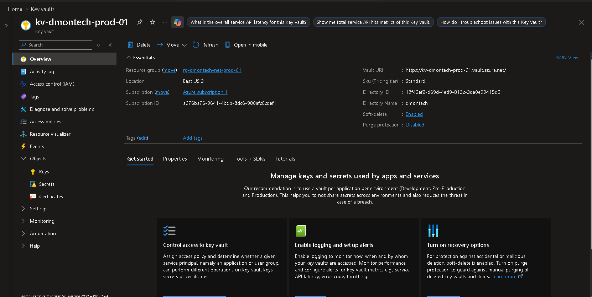
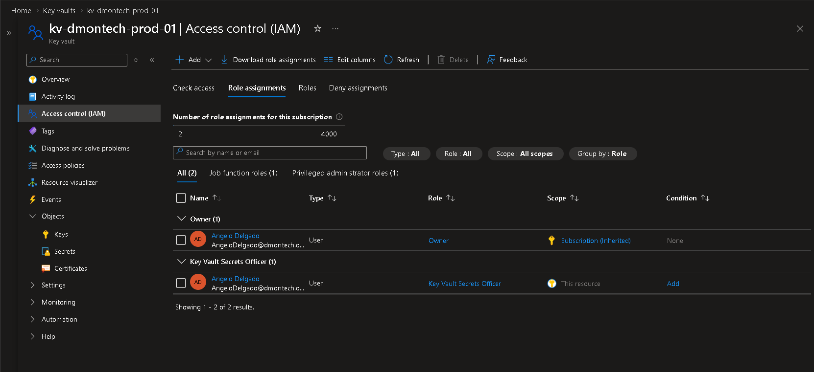
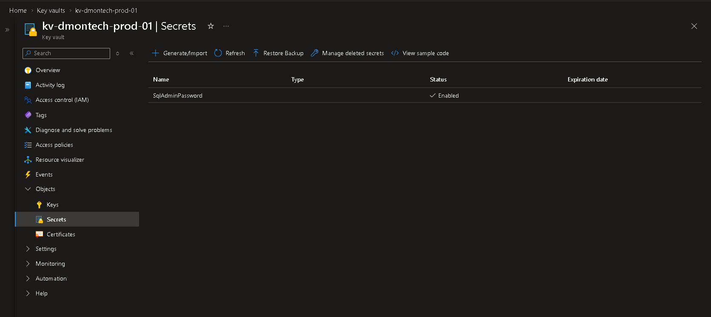

# 🔐 Azure Key Vault

## 📌 Business Requirement

DmonTech required a centralized and secure mechanism for storing sensitive information used throughout the Azure environment.

Administrative credentials, application secrets, connection strings, certificates, and cryptographic material should not be embedded directly within applications, scripts, or infrastructure configurations.

The solution needed to provide:

- Centralized secret management.
- Granular access control.
- Integration with Azure RBAC.
- Protection against accidental secret exposure.
- Support for future application and automation integrations.
- Alignment with Zero Trust and Least Privilege principles.

---

## 🎯 Objective

Deploy Azure Key Vault as the centralized secrets management platform for the DmonTech Azure environment.

The implementation was designed to:

- Securely store sensitive information.
- Control secret management through Azure RBAC.
- Separate credentials from applications and scripts.
- Validate secret creation and storage.
- Establish a foundation for future workload integrations.

---

## 🏗️ Architecture

The following Key Vault was deployed:

| Component | Configuration |
|---|---|
| Key Vault | `kv-dmontech-prod-01` |
| Resource Group | `rg-dmontech-net-prod-01` |
| Region | `East US 2` |
| Pricing Tier | `Standard` |
| Authorization Model | Azure RBAC |
| Soft Delete | Enabled |
| Sample Secret | `SqlAdminPassword` |

Azure Key Vault acts as the centralized security boundary for secrets used by workloads and administrative processes.

```text
Azure Workloads / Administrators
              │
              ▼
          Azure RBAC
              │
              ▼
    kv-dmontech-prod-01
              │
              ▼
 Secrets / Keys / Certificates
```

---

## 🔐 RBAC Configuration

Azure Role-Based Access Control was used to manage administrative access to the Key Vault.

The following role was assigned directly at the Key Vault resource scope:

`Key Vault Secrets Officer`

This role provides the permissions required to create, update, delete, and manage secrets without granting unnecessary administrative permissions over the entire Azure subscription.

The implementation follows the **Principle of Least Privilege**, where identities receive only the permissions necessary to perform their intended administrative functions.

The role assignment was successfully validated through **Access control (IAM)** on `kv-dmontech-prod-01`.

---

## 🔑 Secret Management

A sample secret was created to validate the Key Vault deployment and RBAC permissions.

Secret name:

`SqlAdminPassword`

Status:

`Enabled`

The secret was successfully stored within Azure Key Vault.

The actual secret value was intentionally excluded from screenshots and documentation to prevent sensitive information from being exposed through the Git repository.

This demonstrates how credentials can be separated from application code, scripts, and infrastructure documentation while remaining centrally managed.

---

## 🛡️ Security

The Key Vault implementation improves the security posture of the DmonTech environment through:

- Centralized secret storage.
- Azure RBAC authorization.
- Least Privilege access control.
- Resource-scoped administrative permissions.
- Separation of credentials from applications and scripts.
- Reduced risk of accidental credential exposure.
- Soft Delete protection.
- Support for future managed identity integrations.

Sensitive secret values are never stored directly within the repository.

---

## 📸 Evidence

### Azure Key Vault Overview

The deployed `kv-dmontech-prod-01` Key Vault is running in **East US 2** using the **Standard** pricing tier.

The configuration also confirms that **Soft Delete** is enabled.



### RBAC Role Assignment

The **Key Vault Secrets Officer** role was assigned directly at the Key Vault resource scope, providing the required permissions for secret administration while following the Principle of Least Privilege.



### Secret List

The `SqlAdminPassword` secret was successfully created and is shown as **Enabled**.

The secret value itself is intentionally not displayed or stored in the repository.



---

## 🧠 Architectural Decisions

### Azure RBAC Authorization

Azure RBAC was selected to integrate Key Vault permissions with Azure's centralized identity and access management model.

This provides a consistent authorization approach across the Azure environment and allows permissions to be controlled using standard Azure role assignments.

### Resource-Level Role Assignment

The `Key Vault Secrets Officer` role was assigned specifically at the `kv-dmontech-prod-01` resource scope.

This limits secret-management privileges to the required Key Vault instead of granting broader permissions across the subscription.

### Secret Values Excluded from Documentation

Only the secret name and operational status are documented.

Actual secret values are never stored in:

- Markdown documentation.
- Screenshots.
- Source control.
- Infrastructure scripts.
- Repository configuration files.

This prevents credentials from being unintentionally exposed through the project repository.

### Soft Delete

Soft Delete is enabled on the Key Vault.

This provides additional protection against accidental deletion by allowing deleted Key Vault objects to remain recoverable during their retention period.

---

## 💰 Cost Management

Azure Key Vault uses a consumption-based pricing model, with costs primarily associated with operations performed against secrets, keys, and certificates.

For this lab environment, only a minimal number of secrets and operations were required.

The Standard tier provides the functionality required to demonstrate enterprise secret management without introducing unnecessary infrastructure or significant persistent costs.

---

## ✅ Validation

The following validations were completed:

- [x] Azure Key Vault successfully deployed.
- [x] Key Vault deployed as `kv-dmontech-prod-01`.
- [x] Key Vault deployed in `East US 2`.
- [x] Standard pricing tier configured.
- [x] Soft Delete enabled.
- [x] Azure RBAC used for authorization.
- [x] `Key Vault Secrets Officer` role assigned.
- [x] Role assignment scoped directly to the Key Vault.
- [x] `SqlAdminPassword` secret successfully created.
- [x] Secret status confirmed as `Enabled`.
- [x] Secret value excluded from documentation and screenshots.

The deployment successfully demonstrated centralized and controlled secret management within the DmonTech Azure environment.

---

## 📚 Lessons Learned

Azure Key Vault provides a centralized mechanism for separating sensitive information from applications, scripts, and infrastructure configurations.

Using Azure RBAC simplifies authorization by integrating Key Vault with the same access control model used throughout Azure.

Resource-level role assignments provide more granular control over administrative permissions and support the Principle of Least Privilege.

Sensitive values should never be stored directly in source control, documentation, or infrastructure scripts. Applications and automation processes should instead retrieve required secrets securely from a managed secrets platform such as Azure Key Vault.

The implementation also establishes a foundation for future integration with Azure managed identities, allowing workloads to authenticate to Key Vault without storing credentials locally.

---

## 🏁 Result

Azure Key Vault was successfully implemented as the centralized secrets management service for the DmonTech environment.

The final implementation provides:

- Secure centralized secret storage.
- Azure RBAC-based authorization.
- Least Privilege administrative access.
- Resource-level permission scoping.
- Soft Delete protection.
- Successful secret creation and validation.
- Separation of sensitive credentials from documentation and application code.

This establishes a secure foundation for future integration with Azure virtual machines, managed identities, applications, automation services, and infrastructure deployment workflows.