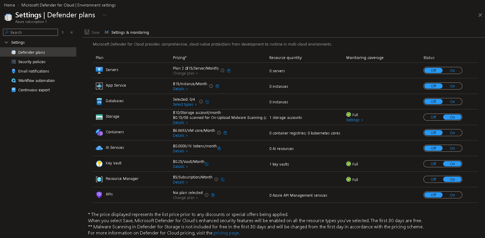

# Microsoft Defender for Cloud

## Overview

Microsoft Defender for Cloud was implemented to improve the security posture of the DmonTech Azure environment through centralized security recommendations, continuous assessment, and cloud security posture management (CSPM).

The service provides visibility into security risks across Azure resources while helping organizations identify misconfigurations, improve compliance, and strengthen their overall security baseline.

For this laboratory, only the Defender plans relevant to the deployed infrastructure were enabled in order to minimize unnecessary resource consumption while demonstrating enterprise security capabilities.

---

# Business Requirements

The organization required:

- Continuously assess Azure resources against security best practices.
- Improve the organization's cloud security posture.
- Receive centralized security recommendations.
- Prepare the environment for future threat detection capabilities.
- Align Azure resources with Microsoft's security recommendations.

---

# Solution Overview

Microsoft Defender for Cloud was configured at the Azure subscription level.

Subscription

```
Azure subscription 1
```

Core Security Service

```
Foundational CSPM
```

Additional Defender Plans Enabled

- Storage
- Key Vault
- Resource Manager

Plans for services that were not deployed within this laboratory, such as Virtual Machines, Containers, Databases, and App Services, were intentionally left disabled.

---

# Security Posture Management

Microsoft Defender for Cloud continuously evaluates Azure resources and compares their configuration against Microsoft's recommended security baselines.

The service provides:

- Secure Score assessment.
- Security recommendations.
- Resource inventory.
- Compliance insights.
- Security posture visibility.

This enables administrators to proactively identify configuration weaknesses before they become security incidents.

---

# Defender Plans

Only the plans applicable to the deployed Azure resources were enabled.

Enabled

```
Storage
Key Vault
Resource Manager
```

Not Enabled

```
Servers
Containers
Databases
App Services
AI Services
APIs
```

This approach reduces unnecessary costs while maintaining security coverage for the services implemented in this project.

---

# Validation

The following validations were completed:

- Microsoft Defender for Cloud enabled.
- Subscription successfully onboarded.
- Defender plans configured.
- Security posture assessment available.
- Secure Score and recommendations accessible.

---

# Security Benefits

Microsoft Defender for Cloud provides several advantages:

- Continuous security assessment.
- Centralized security recommendations.
- Improved cloud governance.
- Better visibility into Azure security posture.
- Support for Zero Trust initiatives.
- Integration with Microsoft Sentinel.

---

# Lessons Learned

Microsoft Defender for Cloud should be viewed as a proactive security platform rather than only a threat detection solution.

Its ability to continuously evaluate Azure resources helps administrators identify configuration issues early, reducing operational risk and improving long-term governance.

Enabling only the Defender plans required for deployed resources provides a balance between security visibility and cost optimization.

---

# Screenshots

-Defender Plans

