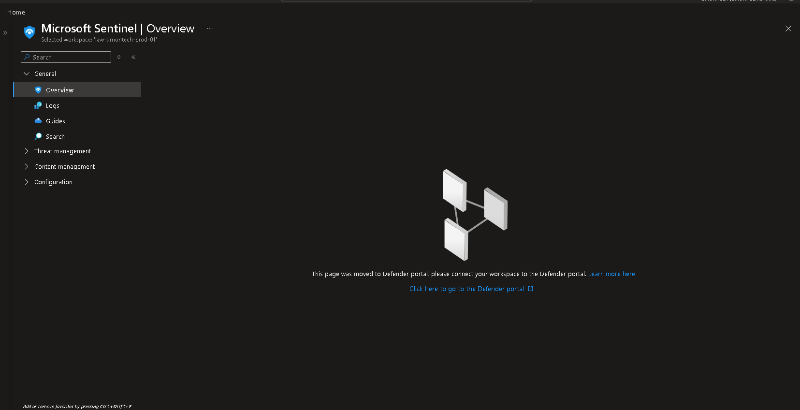

# 🛡️ Microsoft Sentinel

## 📌 Business Requirement

DmonTech required a centralized Security Information and Event Management (SIEM) platform capable of consolidating security telemetry and providing a foundation for threat detection, investigation, and incident response.

The solution needed to provide:

- Centralized security monitoring.
- Integration with Azure security services.
- Collection of Azure Activity Logs.
- A centralized platform for security investigations.
- Support for future threat detection capabilities.
- Integration with Microsoft Defender for Cloud.
- A scalable foundation for future Security Operations Center (SOC) capabilities.

---

## 🎯 Objective

Deploy Microsoft Sentinel as the centralized SIEM platform for the DmonTech Azure environment.

The implementation was designed to:

- Centralize security monitoring.
- Connect Sentinel to a Log Analytics Workspace.
- Prepare Azure Activity Logs for centralized analysis.
- Establish the foundation for security analytics.
- Support future incident investigation and threat hunting.
- Integrate security monitoring with the broader DmonTech security architecture.

---

## 🏗️ Solution Overview

Microsoft Sentinel was enabled using the existing Log Analytics Workspace.

| Component | Configuration |
|---|---|
| SIEM Platform | Microsoft Sentinel |
| Workspace | `law-dmontech-prod-01` |
| Deployment Model | Workspace-based |
| Primary Data Source | Azure Activity Logs |
| Cloud Platform | Microsoft Azure |

The Log Analytics Workspace acts as the centralized data repository used by Microsoft Sentinel for security monitoring and analysis.

This architecture allows additional Azure and Microsoft security data sources to be integrated as the environment expands.

---

## 🏛️ Architecture

Microsoft Sentinel was implemented using the following monitoring architecture:

```text
            Azure Resources
                  │
                  ▼
         Azure Activity Logs
                  │
                  ▼
      Log Analytics Workspace
       law-dmontech-prod-01
                  │
                  ▼
         Microsoft Sentinel
                  │
       ┌──────────┼──────────┐
       ▼          ▼          ▼
    Analytics   Hunting   Incidents
```

Azure resources generate operational and security telemetry that can be centralized through the Log Analytics Workspace.

Microsoft Sentinel provides the SIEM layer responsible for analyzing this information and supporting security operations.

---

## 📊 Log Analytics Workspace

The following workspace was used as the foundation for Microsoft Sentinel:

```text
law-dmontech-prod-01
```

The workspace provides centralized storage and querying capabilities for Azure monitoring and security telemetry.

Using Log Analytics as the underlying data platform allows Microsoft Sentinel to analyze collected information using Kusto Query Language (KQL) and integrate additional data sources in the future.

---

## 📥 Security Data Collection

Azure Activity Logs were selected as the primary Azure data source for the initial Sentinel implementation.

Activity Logs provide visibility into subscription-level administrative operations such as:

- Resource creation.
- Resource deletion.
- Configuration changes.
- Administrative operations.
- Resource management activities.

Centralizing these events provides an important audit trail for investigating administrative activity across the Azure environment.

The architecture can later be expanded with additional data sources as more services are introduced.

---

## 🔎 Monitoring Capabilities

Microsoft Sentinel provides a centralized security operations platform with capabilities including:

- Security log collection.
- Security analytics.
- Incident investigation.
- Threat hunting.
- Centralized security visibility.
- Integration with Microsoft Defender services.
- KQL-based log analysis.
- Security automation through Playbooks.

The current implementation establishes the SIEM foundation required to introduce these capabilities progressively.

---

## 🚨 Threat Detection

Microsoft Sentinel can analyze collected security telemetry using analytics rules.

These rules can identify suspicious behavior and generate security incidents for investigation.

Potential future detection scenarios within the DmonTech environment include:

```text
Suspicious Azure administrative activity
Repeated authentication failures
Unexpected resource deletion
Privilege escalation activity
Security configuration changes
Unusual Key Vault operations
Network security modifications
```

Advanced analytics rules were outside the scope of the initial deployment but can be implemented as the security monitoring environment matures.

---

## 🔍 Threat Hunting

Microsoft Sentinel provides threat hunting capabilities using Kusto Query Language (KQL).

Security administrators can query collected telemetry to investigate suspicious behavior and identify patterns that may not have generated automated alerts.

Example investigation areas include:

- Administrative activity.
- Resource configuration changes.
- Identity-related events.
- Security control modifications.
- Network changes.
- Key Vault operations.

This provides the foundation for proactive security investigations.

---

## 🔗 Microsoft Defender Integration

Microsoft Sentinel complements Microsoft Defender for Cloud within the DmonTech security architecture.

The two services perform different but complementary functions:

| Service | Primary Function |
|---|---|
| Microsoft Defender for Cloud | Cloud Security Posture Management and workload protection |
| Microsoft Sentinel | Security Information and Event Management |

Defender for Cloud continuously evaluates the security posture of Azure resources, while Microsoft Sentinel provides centralized security monitoring, analytics, investigation, and incident management capabilities.

Together, these services establish a stronger cloud security monitoring architecture.

---

## 🛡️ Security Architecture

Microsoft Sentinel operates as the centralized security monitoring layer within the DmonTech environment.

```text
       Azure Resources
              │
              ▼
      Security Telemetry
              │
              ▼
   Log Analytics Workspace
              │
              ▼
      Microsoft Sentinel
              │
     ┌────────┴────────┐
     ▼                 ▼
Detection          Investigation
     │                 │
     └────────┬────────┘
              ▼
       Incident Response
```

This architecture allows security telemetry from multiple Azure services to eventually converge into a centralized security operations platform.

---

## 🔐 Security Benefits

The Microsoft Sentinel implementation provides several security advantages:

- Centralized security visibility.
- Cloud-native SIEM capabilities.
- Centralized log analysis.
- Scalable security monitoring.
- Integration with Microsoft Defender services.
- Support for incident investigation.
- Threat hunting capabilities.
- Future security automation.
- Centralized auditing of Azure administrative activity.

These capabilities improve the organization's ability to detect and investigate security events across the Azure environment.

---

## 📸 Evidence

### Microsoft Sentinel Overview

Microsoft Sentinel was successfully enabled and associated with the Log Analytics Workspace:

```text
law-dmontech-prod-01
```

The Azure portal confirms that the workspace is recognized by Microsoft Sentinel.

The portal also indicates that the primary Microsoft Sentinel experience has moved to the Microsoft Defender portal, reflecting Microsoft's unified security operations experience.



---

## 🧠 Architectural Decisions

### Workspace-Based Deployment

Microsoft Sentinel was deployed using the existing Log Analytics Workspace rather than creating an isolated monitoring environment.

This centralizes telemetry and simplifies security data management.

### Centralized Security Monitoring

Security monitoring was designed around a centralized SIEM architecture.

Instead of reviewing security events independently across individual Azure services, Microsoft Sentinel provides a common platform for investigation and analysis.

### Azure Activity Logs

Azure Activity Logs were selected as an initial data source because they provide visibility into subscription-level administrative operations.

This establishes an audit foundation for tracking changes to Azure infrastructure.

### Future Expansion

The initial implementation focuses on establishing the Sentinel platform rather than implementing a complete production SOC.

The architecture can later be expanded with:

- Additional data connectors.
- Analytics rules.
- Automation rules.
- Workbooks.
- Hunting queries.
- Playbooks.
- Microsoft Defender integrations.
- Identity security telemetry.

This allows the security monitoring environment to grow alongside the infrastructure.

---

## 🔗 Zero Trust Alignment

Microsoft Sentinel supports the broader DmonTech Zero Trust architecture by providing centralized visibility into security events across the environment.

The implementation contributes to Zero Trust principles through:

- Continuous monitoring.
- Centralized security visibility.
- Security event correlation.
- Investigation capabilities.
- Detection of suspicious administrative activity.
- Integration with other Microsoft security services.

Sentinel complements preventive controls such as Azure Policy, Azure RBAC, Network Security Groups, Azure Key Vault, and Microsoft Defender for Cloud by adding centralized monitoring and investigation capabilities.

---

## ✅ Validation

The following validations were completed:

- [x] Log Analytics Workspace available.
- [x] Workspace `law-dmontech-prod-01` configured.
- [x] Microsoft Sentinel successfully enabled.
- [x] Sentinel associated with the Log Analytics Workspace.
- [x] Workspace visible from Microsoft Sentinel.
- [x] Environment prepared for Azure Activity Log ingestion.
- [x] Centralized SIEM foundation established.
- [x] Environment prepared for future analytics and threat detection capabilities.
- [x] Integration path with Microsoft Defender security services established.

The deployment successfully establishes Microsoft Sentinel as the centralized SIEM foundation for the DmonTech Azure environment.

---

## 📚 Lessons Learned

Microsoft Sentinel provides the centralized monitoring and analytics layer required for building cloud-native security operations.

Deploying Sentinel early in the infrastructure lifecycle creates a foundation that can grow as additional workloads, identities, and security services are introduced.

The Log Analytics Workspace plays a critical role because it provides the underlying platform for storing and querying security telemetry.

Microsoft Sentinel also complements Microsoft Defender for Cloud rather than replacing it. Defender for Cloud focuses primarily on security posture and workload protection, while Sentinel provides SIEM capabilities for centralized monitoring, detection, investigation, and incident response.

The migration of the Sentinel experience toward the Microsoft Defender portal also demonstrates Microsoft's direction toward unified security operations across its security products.

---

## 🏁 Result

Microsoft Sentinel was successfully deployed as the centralized SIEM platform for the DmonTech Azure environment.

The final implementation provides:

- Microsoft Sentinel deployment.
- Integration with `law-dmontech-prod-01`.
- Centralized security monitoring architecture.
- Foundation for Azure Activity Log analysis.
- Integration with the broader Microsoft security ecosystem.
- Future support for analytics rules and threat detection.
- Threat hunting capabilities.
- Future incident management and automation capabilities.
- A scalable foundation for Security Operations Center functionality.

The implementation establishes the monitoring and analytics layer required to expand DmonTech's Zero Trust and cloud security architecture as additional Azure services are introduced.