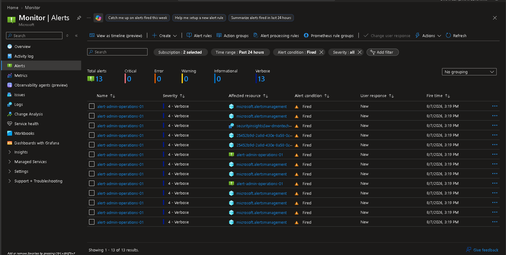
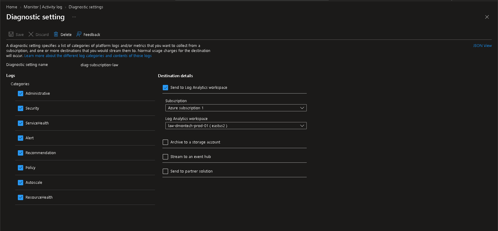
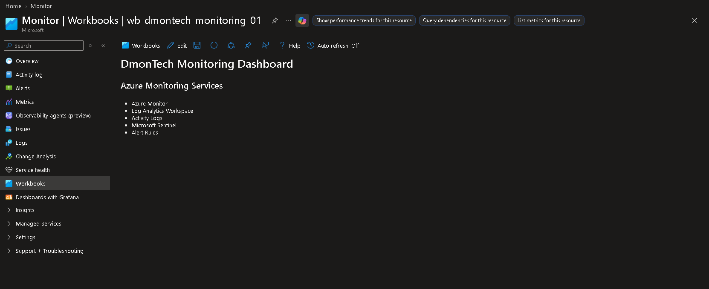

# 📊 Azure Monitor

## 📌 Business Requirement

DmonTech required a centralized monitoring solution capable of providing operational visibility across the Azure environment.

The monitoring platform needed to collect subscription-level telemetry, track administrative operations, centralize logs, and provide a foundation for troubleshooting, reporting, alerting, and security monitoring.

The organization required:

- Centralized Azure monitoring.
- Collection of Azure platform logs.
- Detection of important administrative operations.
- Historical log retention and analysis.
- Centralized operational visibility.
- Integration with Microsoft Sentinel.
- Support for future troubleshooting and reporting.
- A scalable monitoring architecture for additional Azure workloads.

---

## 🎯 Objective

Implement Azure Monitor as the centralized monitoring platform for the DmonTech Azure environment.

The implementation was designed to:

- Collect Azure Activity Logs.
- Centralize telemetry in Log Analytics.
- Detect subscription-level administrative operations.
- Provide operational dashboards through Azure Workbooks.
- Integrate monitoring data with Microsoft Sentinel.
- Establish the foundation for future alerting and automation.

---

## 🏗️ Solution Overview

The monitoring solution consists of several integrated Azure services:

| Component | Purpose |
|---|---|
| Azure Monitor | Central monitoring platform |
| Log Analytics Workspace | Centralized log repository |
| Activity Log Diagnostic Settings | Subscription log forwarding |
| Azure Monitor Alert Rules | Administrative activity detection |
| Azure Workbooks | Monitoring visualization |
| Microsoft Sentinel | Security monitoring and analytics |

Together, these services provide centralized collection, storage, analysis, alerting, and visualization of Azure operational telemetry.

---

## 📊 Log Analytics Workspace

A Log Analytics Workspace was deployed as the centralized repository for monitoring and security telemetry.

### Workspace

```text
law-dmontech-prod-01
```

### Region

```text
East US 2
```

The workspace provides centralized storage for Azure Activity Logs and acts as a shared telemetry platform for Azure Monitor and Microsoft Sentinel.

This architecture prevents monitoring information from remaining isolated across individual Azure resources.

---

## 🚨 Azure Monitor Alert Rule

An Azure Monitor Alert Rule was implemented to detect administrative operations performed within the Azure subscription.

### Alert Rule

```text
alert-admin-operations-01
```

### Scope

```text
Azure Subscription
```

### Signal

```text
All Administrative Operations
```

The rule monitors management-plane operations occurring within the configured scope.

During validation, the alert rule successfully generated alert instances when administrative operations occurred, confirming that the monitoring configuration was operational.

The alert can later be extended using Action Groups to trigger:

- Email notifications.
- SMS notifications.
- Webhooks.
- Azure Functions.
- Logic Apps.
- Automation workflows.
- Incident response processes.

---

## 🔔 Alert Validation

The Azure Monitor Alerts interface confirmed that the configured rule successfully fired.

Multiple alert instances associated with:

```text
alert-admin-operations-01
```

were generated during administrative activity.

The validation demonstrated the complete monitoring path:

```text
Administrative Operation
        │
        ▼
Azure Monitor
        │
        ▼
Alert Rule Evaluation
        │
        ▼
alert-admin-operations-01
        │
        ▼
Alert Fired
```

This confirms that Azure Monitor can detect management-plane activity occurring within the environment.

---

## 📝 Diagnostic Settings

Azure Activity Logs were configured to be exported to the centralized Log Analytics Workspace.

### Diagnostic Setting

```text
diag-subscription-law
```

### Destination

```text
law-dmontech-prod-01
```

### Destination Type

```text
Log Analytics Workspace
```

The diagnostic configuration forwards subscription-level Activity Log events to Log Analytics for centralized retention and analysis.

---

## 📥 Activity Log Categories

The following Activity Log categories were enabled:

```text
Administrative
Security
ServiceHealth
Alert
Recommendation
Policy
Autoscale
ResourceHealth
```

These categories provide visibility across several important operational areas.

| Category | Purpose |
|---|---|
| Administrative | Resource management operations |
| Security | Subscription-level security events |
| ServiceHealth | Azure service health events |
| Alert | Azure alert activity |
| Recommendation | Azure recommendations |
| Policy | Azure Policy operations |
| Autoscale | Autoscaling operations |
| ResourceHealth | Resource health changes |

Centralizing these logs allows administrators to investigate events without reviewing each Azure resource independently.

---

## 🔄 Centralized Log Flow

The implemented diagnostic architecture follows this flow:

```text
Azure Subscription
        │
        ▼
Azure Activity Log
        │
        ▼
diag-subscription-law
        │
        ▼
Log Analytics Workspace
law-dmontech-prod-01
        │
        ├──────────────► Azure Monitor
        │
        └──────────────► Microsoft Sentinel
```

This creates a shared monitoring and security telemetry platform.

---

## 📈 Azure Workbook

An Azure Workbook was created to establish a centralized monitoring dashboard for the DmonTech environment.

### Workbook

```text
wb-dmontech-monitoring-01
```

### Dashboard

```text
DmonTech Monitoring Dashboard
```

The workbook consolidates the major monitoring components implemented within the environment.

The dashboard identifies the following monitoring services:

- Azure Monitor.
- Log Analytics Workspace.
- Activity Logs.
- Microsoft Sentinel.
- Alert Rules.

This workbook establishes the foundation for future operational dashboards containing queries, metrics, charts, resource health information, and security telemetry.

---

## 📊 Monitoring Architecture

The complete monitoring architecture implemented in the DmonTech environment is:

```text
                    Azure Resources
                           │
                           ▼
                    Activity Logs
                           │
                           ▼
                  Diagnostic Settings
                 diag-subscription-law
                           │
                           ▼
               Log Analytics Workspace
                law-dmontech-prod-01
                           │
              ┌────────────┴────────────┐
              │                         │
              ▼                         ▼
        Azure Monitor            Microsoft Sentinel
              │                         │
              ▼                         ▼
         Alert Rules             Security Analysis
              │
              ▼
     Azure Monitor Alerts
              │
              ▼
        Azure Workbooks
```

The architecture separates telemetry generation from analysis and visualization while maintaining a centralized data repository.

---

## 🔍 Monitoring Capabilities

The implemented solution provides several monitoring capabilities:

- Subscription-level Activity Log collection.
- Administrative operation detection.
- Centralized log storage.
- Historical log analysis.
- Azure Monitor alerting.
- Operational dashboard visualization.
- Integration with Microsoft Sentinel.
- Centralized troubleshooting data.

The platform can be expanded as additional Azure workloads are deployed.

---

## 🔗 Microsoft Sentinel Integration

The same Log Analytics Workspace used by Azure Monitor also supports Microsoft Sentinel.

```text
law-dmontech-prod-01
```

This creates a shared telemetry architecture where operational monitoring and security monitoring can use centralized log data.

The services perform complementary functions:

| Service | Primary Function |
|---|---|
| Azure Monitor | Infrastructure and operational monitoring |
| Log Analytics | Centralized log storage and querying |
| Microsoft Sentinel | SIEM and security analytics |
| Azure Workbooks | Visualization and dashboards |

This architecture reduces monitoring fragmentation and provides a scalable foundation for both infrastructure operations and security operations.

---

## 🛡️ Operational and Security Visibility

Centralized monitoring provides visibility into administrative changes across the Azure environment.

Examples include:

```text
Resource creation
Resource deletion
Configuration changes
Policy operations
Security events
Resource health changes
Azure service health events
Administrative operations
```

This information can be used for both operational troubleshooting and security investigations.

---

## ⚙️ Future Monitoring Expansion

The current implementation establishes the monitoring foundation.

Future improvements could include:

- VM performance monitoring.
- Network monitoring.
- Application monitoring.
- Custom KQL queries.
- Advanced Azure Workbooks.
- Action Groups.
- Automated notifications.
- Additional metric alerts.
- Resource health alerts.
- Log-based alerts.
- Microsoft Sentinel analytics rules.
- Automated incident response.

These capabilities can be added without redesigning the centralized monitoring architecture.

---

## 🔐 Zero Trust Alignment

Azure Monitor contributes to the broader DmonTech Zero Trust architecture by improving visibility across Azure infrastructure.

The implementation supports Zero Trust through:

- Continuous monitoring.
- Administrative activity tracking.
- Centralized telemetry.
- Security event visibility.
- Configuration change tracking.
- Integration with Microsoft Sentinel.
- Historical investigation capabilities.

Preventive security controls become significantly more effective when combined with centralized monitoring and auditing.

---

## 📸 Evidence

### Azure Monitor Alert Rule

The configured `alert-admin-operations-01` rule successfully generated alerts from administrative operations within the Azure environment.



---

### Activity Log Diagnostic Settings

The `diag-subscription-law` diagnostic setting forwards the configured Azure Activity Log categories to the `law-dmontech-prod-01` Log Analytics Workspace.



---

### Azure Monitoring Workbook

The `wb-dmontech-monitoring-01` workbook provides the foundation for centralized operational visualization through the DmonTech Monitoring Dashboard.



---

## 🧠 Architectural Decisions

### Centralized Log Analytics Workspace

A centralized Log Analytics Workspace was selected instead of maintaining separate monitoring repositories.

This simplifies:

- Log management.
- KQL analysis.
- Sentinel integration.
- Troubleshooting.
- Future dashboard development.

### Subscription-Level Diagnostic Settings

Azure Activity Logs were forwarded at the subscription level to provide broad visibility into management-plane operations.

This allows administrative activity across Azure resources to be analyzed centrally.

### Administrative Operation Alerting

Administrative operations were selected for the initial alert implementation because infrastructure changes represent important operational and security events.

This validates Azure Monitor alerting while creating a useful baseline for future monitoring.

### Shared Monitoring and Security Platform

Azure Monitor and Microsoft Sentinel were designed around the same Log Analytics Workspace.

This allows operational and security telemetry to coexist within a centralized monitoring architecture.

### Azure Workbooks

Azure Workbooks were selected as the visualization layer because they can combine metrics, logs, queries, and monitoring information into customizable dashboards.

The initial workbook establishes the framework for more advanced monitoring dashboards in future phases.

---

## ✅ Validation

The following validations were completed:

- [x] Azure Monitor configured.
- [x] Log Analytics Workspace deployed.
- [x] `law-dmontech-prod-01` available.
- [x] Activity Log Diagnostic Settings configured.
- [x] `diag-subscription-law` configured.
- [x] Activity Log categories selected.
- [x] Logs configured for export to Log Analytics.
- [x] `alert-admin-operations-01` created.
- [x] Administrative operation monitoring enabled.
- [x] Alert rule successfully fired.
- [x] Azure Monitor Alerts successfully generated.
- [x] `wb-dmontech-monitoring-01` created.
- [x] DmonTech Monitoring Dashboard created.
- [x] Microsoft Sentinel integrated with the shared workspace.

The monitoring platform successfully provides centralized operational visibility across the DmonTech Azure environment.

---

## 💼 Operational Benefits

The Azure Monitor implementation provides several operational advantages:

- Centralized monitoring.
- Historical log collection.
- Administrative activity tracking.
- Faster troubleshooting.
- Centralized operational visibility.
- Alert generation.
- Dashboard visualization.
- Integration with security monitoring.
- Scalable telemetry architecture.

These capabilities provide the foundation required for managing a growing Azure environment.

---

## 📚 Lessons Learned

Azure Monitor becomes significantly more powerful when combined with Log Analytics, Diagnostic Settings, Alert Rules, Workbooks, and Microsoft Sentinel.

Rather than monitoring resources independently, centralizing telemetry provides a unified operational view of the Azure environment.

Diagnostic Settings are particularly important because they establish the pipeline that sends Azure Activity Logs into the centralized Log Analytics Workspace.

The successful firing of `alert-admin-operations-01` also demonstrated that Azure Monitor can actively detect management-plane activity rather than simply storing telemetry for later investigation.

Using the same Log Analytics Workspace for Azure Monitor and Microsoft Sentinel creates a scalable architecture capable of supporting both infrastructure operations and security operations.

---

## 🏁 Result

Azure Monitor was successfully implemented as the centralized monitoring platform for the DmonTech Azure environment.

The final solution provides:

- Centralized Azure monitoring.
- Log Analytics integration.
- Subscription Activity Log collection.
- Diagnostic Settings.
- Administrative operation alerting.
- Successfully validated Azure Monitor alerts.
- Azure Workbook visualization.
- Microsoft Sentinel integration.
- Historical operational telemetry.
- A scalable foundation for future monitoring and automation.

The implementation establishes the observability layer required to monitor, troubleshoot, audit, and secure the DmonTech Azure infrastructure as the environment continues to expand.