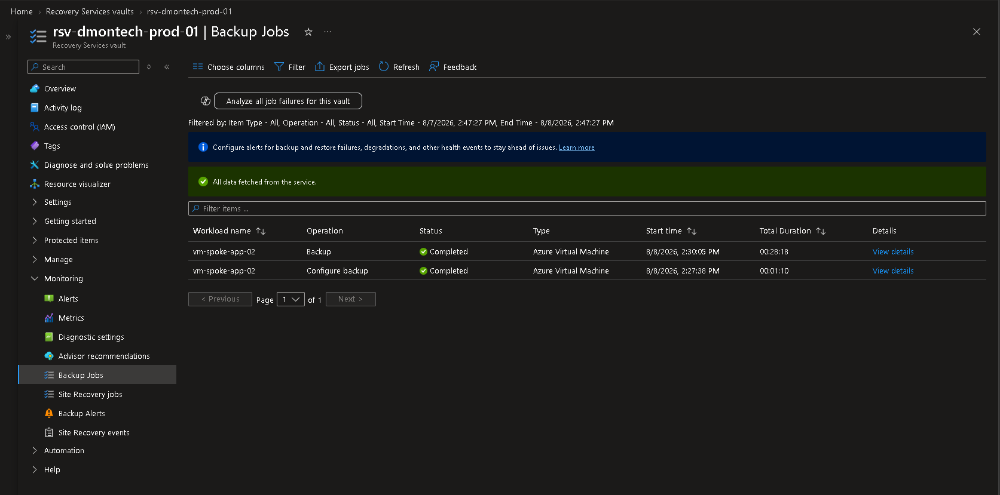
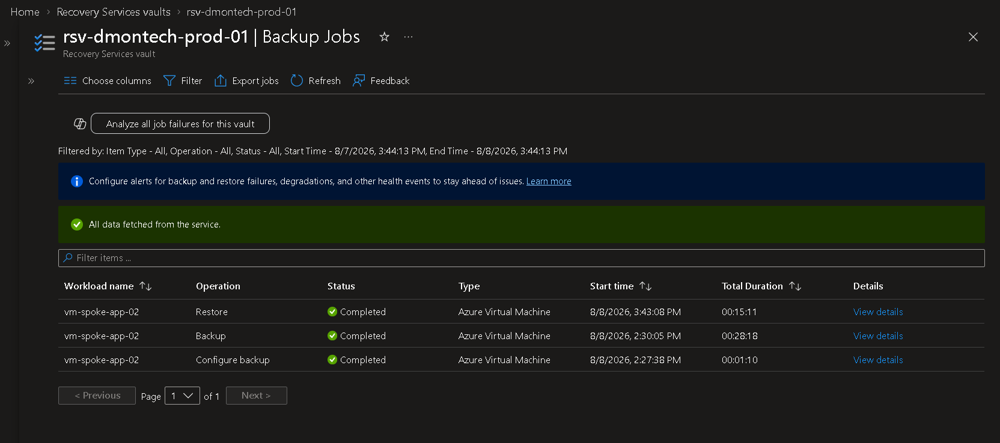

# Azure Backup and Recovery

## Overview

Azure Backup was implemented in the DmonTech environment to provide backup and recovery capabilities for Azure virtual machine workloads.

A Recovery Services Vault was used to protect the workload virtual machine `vm-spoke-app-02`.

The implementation was validated through an end-to-end recovery workflow:

1. Configure Azure VM backup.
2. Execute an on-demand backup.
3. Generate a recovery point.
4. Restore the existing virtual machine from the recovery point.
5. Validate successful completion of the restore operation.

This demonstrates not only backup configuration, but also the ability to successfully recover a protected Azure workload.

---

## Resources

| Resource | Configuration |
|---|---|
| Recovery Services Vault | `rsv-dmontech-prod-01` |
| Protected VM | `vm-spoke-app-02` |
| Workload Type | Azure Virtual Machine |
| Backup Service | Azure Backup |
| Restore Target | Existing virtual machine |
| Restore Method | Replace Existing |

---

## Recovery Services Vault

The Recovery Services Vault `rsv-dmontech-prod-01` was used as the centralized management resource for backup and recovery operations.

The vault provides:

- Backup policy management.
- Recovery point management.
- Backup job monitoring.
- Restore operations.
- Centralized protection of Azure workloads.

The workload VM `vm-spoke-app-02` was protected using Azure Backup through the Recovery Services Vault.

---

## VM Backup

After backup protection was configured, an on-demand backup was manually initiated for `vm-spoke-app-02`.

Executing an on-demand backup allowed the configuration to be validated immediately instead of waiting for the next scheduled backup operation.

The operation completed successfully and generated a recovery point that could subsequently be used for workload recovery.

---

## Backup Validation

Azure Backup Jobs was used to monitor the protection process.

The following operations completed successfully:

| Operation | Status |
|---|---|
| Configure backup | Completed |
| Backup | Completed |

The successful backup confirmed that the virtual machine was protected and that Azure Backup was capable of generating a recovery point for the workload.

### Successful Backup Job



*Azure Backup Jobs showing successful backup configuration and on-demand backup execution for `vm-spoke-app-02`.*

---

## Restore Test

A backup strategy should not rely solely on successful backup jobs. The ability to restore a workload must also be validated.

For this reason, an actual restore operation was performed against `vm-spoke-app-02`.

A recovery point generated by the previous backup was selected and the restore target was configured as:

```text
Replace Existing
```

This option restored the existing protected virtual machine using the selected recovery point rather than deploying an additional recovery VM.

Using this approach allowed the recovery process to be tested while avoiding the deployment of unnecessary compute resources.

---

## Restore Validation

The restore operation was monitored through Azure Backup Jobs until completion.

The final job history showed:

| Workload | Operation | Status |
|---|---|---|
| `vm-spoke-app-02` | Configure backup | Completed |
| `vm-spoke-app-02` | Backup | Completed |
| `vm-spoke-app-02` | Restore | Completed |

This validated the complete backup and recovery lifecycle.

### End-to-End Backup and Restore Validation



*Final Azure Backup job history showing successful Configure Backup, Backup, and Restore operations.*

The final job history confirms that the workload was not only successfully backed up, but also successfully recovered from an Azure Backup recovery point.

---

## Recovery Workflow

The validated recovery process follows this model:

```text
vm-spoke-app-02
       |
       v
+--------------------+
| Configure Backup   |
+--------------------+
       |
       v
+--------------------+
|  On-Demand Backup  |
+--------------------+
       |
       v
+--------------------+
|   Recovery Point   |
+--------------------+
       |
       v
+--------------------+
|  Replace Existing  |
|      Restore       |
+--------------------+
       |
       v
+--------------------+
|     Completed      |
+--------------------+
```

---

## Operational Considerations

The implementation demonstrates several important backup and recovery practices:

- Centralized backup management through Recovery Services Vault.
- Protection of Azure virtual machine workloads.
- On-demand backup execution.
- Recovery point creation.
- Backup and restore job monitoring.
- Restoration of an existing workload from a known recovery point.
- End-to-end validation of the recovery process.

Performing a restore test is particularly important because a successful backup operation alone does not guarantee that the workload can be recovered when required.

---

## Lessons Learned

Azure Backup provides both workload protection and centralized recovery management for Azure virtual machines.

The implementation demonstrated the importance of validating the complete recovery lifecycle rather than considering a successful backup job sufficient evidence of recoverability.

Using the `Replace Existing` restore method allowed the recovery point to be tested against the original workload without maintaining an additional recovery virtual machine.

Azure Backup Jobs also provided a centralized location for monitoring each stage of the process and confirming successful completion.

---

## Result

Azure Backup was successfully implemented and tested within the DmonTech environment.

The implementation demonstrated:

- Recovery Services Vault administration.
- Azure VM backup protection.
- On-demand backup execution.
- Recovery point creation.
- VM restoration using `Replace Existing`.
- Backup and restore job monitoring.
- Successful end-to-end recovery validation.

The successful restore confirmed that the protected workload could be recovered from Azure Backup, providing DmonTech with a tested recovery capability rather than an unvalidated backup-only configuration.