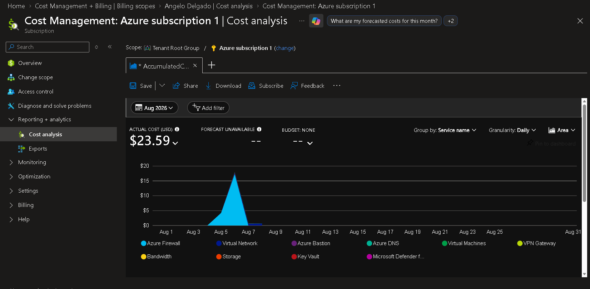
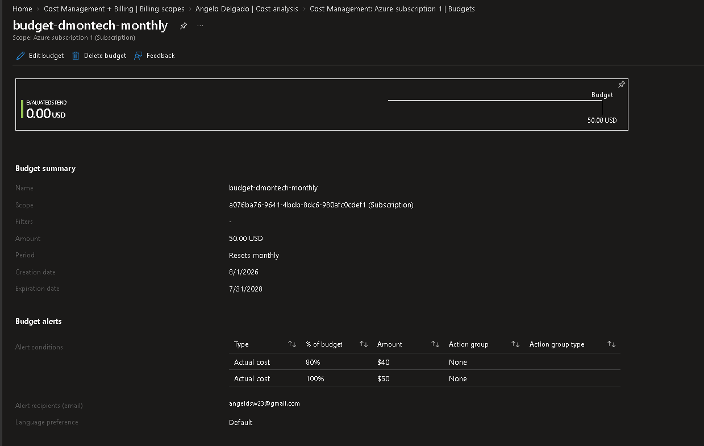

# Azure Cost Management and Budgeting

## Overview

Azure Cost Management was used to monitor and control the financial impact of the DmonTech cloud infrastructure.

Because the environment was designed as a technical lab using a limited Azure subscription budget, cost visibility was considered an important architectural requirement throughout the project.

Cost Analysis was used to identify spending by Azure service, while Azure Budgets was configured to provide proactive notifications when subscription spending approaches predefined thresholds.

---

## Business Requirements

The organization required:

- Centralized visibility into Azure consumption.
- Identification of the services responsible for cloud spending.
- Monthly budget controls.
- Automated notifications when spending approaches defined limits.
- Cost-conscious deployment and lifecycle management of Azure resources.
- Removal of temporary resources after validation.

---

## Cost Analysis

Azure Cost Analysis was configured at the subscription scope to provide visibility into the cost generated by the DmonTech environment.

Configuration:

| Setting | Value |
|---|---|
| Scope | Azure subscription |
| Period | August 2026 |
| Granularity | Daily |
| Group By | Service name |

At the time of the analysis, the subscription showed an accumulated cost of approximately:

```text
$23.59 USD
```

Grouping the data by service made it possible to identify which Azure services were responsible for the majority of infrastructure costs.

### Cost Analysis Evidence



*Azure Cost Analysis showing daily subscription spending grouped by Azure service.*

---

## Cost Optimization Strategy

Cost management was incorporated into the infrastructure deployment process rather than being treated only as a reporting activity.

Several temporary resources were removed after their configuration and validation were completed.

Examples included:

- Azure Firewall
- Azure Bastion
- VPN Gateway
- Application Gateway
- Load Balancer
- Virtual Machine Scale Set
- Temporary virtual machine resources
- Recovery Services Vault after backup and restore validation

This approach allowed enterprise Azure services to be implemented and documented while minimizing unnecessary consumption after testing was complete.

Persistent low-cost resources were retained where useful for maintaining the architecture and project documentation.

---

## Azure Budget

A monthly Azure Budget was created at the subscription level to provide proactive cost monitoring.

Budget configuration:

| Setting | Value |
|---|---|
| Budget Name | `budget-dmontech-monthly` |
| Scope | Azure subscription |
| Reset Period | Monthly |
| Budget Amount | $50 USD |
| Alert Type | Actual cost |
| First Threshold | 80% |
| Second Threshold | 100% |
| Notification Method | Email |

The first threshold triggers when actual spending reaches:

```text
$40 USD
```

The second threshold triggers when actual spending reaches:

```text
$50 USD
```

This provides early warning before spending exceeds the defined monthly budget.

### Budget and Alert Evidence



*Monthly DmonTech budget configured with actual-cost alerts at 80% and 100%.*

---

## Cost Governance

The cost management design combines monitoring with proactive controls.

```text
Azure Subscription
        |
        v
+----------------------+
|    Cost Analysis     |
| Daily / By Service   |
+----------------------+
        |
        v
+----------------------+
|    Azure Budget      |
|       $50/month      |
+----------------------+
        |
        +----------------+
        |                |
        v                v
   80% Threshold    100% Threshold
      ($40)             ($50)
        |                |
        +-------+--------+
                |
                v
        Email Notification
```

This model provides both historical cost visibility and proactive spending notifications.

---

## Resource Lifecycle and Cost Control

One of the main cost-management practices used throughout the project was resource lifecycle management.

High-cost services were deployed when required for implementation and validation, documented through screenshots and technical documentation, and then removed when they were no longer required.

This was particularly important for services that generate costs continuously while provisioned.

The approach demonstrates an important cloud architecture principle:

> Cloud resources should exist because they provide current business value, not simply because they were previously deployed.

Temporary lab infrastructure therefore did not remain provisioned after its technical objective had been completed.

---

## Operational Benefits

The implemented cost-management approach provides:

- Subscription-level cost visibility.
- Daily cost tracking.
- Service-level spending analysis.
- Proactive budget notifications.
- Early detection of unexpected spending.
- Better understanding of Azure service cost behavior.
- Improved resource lifecycle management.
- Reduced unnecessary cloud consumption.

---

## Lessons Learned

Cloud architecture decisions have both technical and financial consequences.

Services such as Azure Firewall, VPN Gateway, Application Gateway, Bastion, and compute resources can generate costs while provisioned even when they are not actively being used.

For this reason, cost management should be considered throughout the infrastructure lifecycle rather than only after deployment.

Azure Cost Analysis provides visibility into where money is being spent, while Azure Budgets provides proactive controls that help administrators respond before spending exceeds expected limits.

The project also demonstrated the value of removing temporary resources immediately after validation, particularly in development and laboratory environments.

---

## Result

Azure Cost Management was successfully incorporated into the DmonTech infrastructure project.

The implementation demonstrated:

- Subscription-level Cost Analysis.
- Daily cost monitoring.
- Cost analysis grouped by Azure service.
- Monthly budget configuration.
- Actual-cost thresholds at 80% and 100%.
- Email-based budget notifications.
- Active resource lifecycle management.
- Cost-conscious deployment of enterprise Azure services.

Cost management therefore became part of the architecture and operational strategy rather than simply a final reporting step.